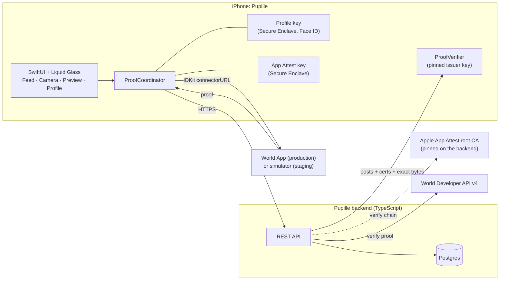
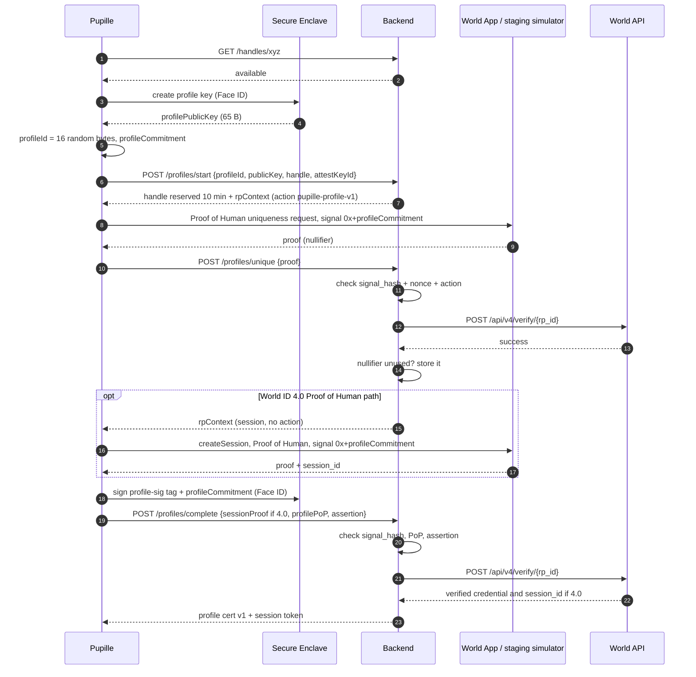
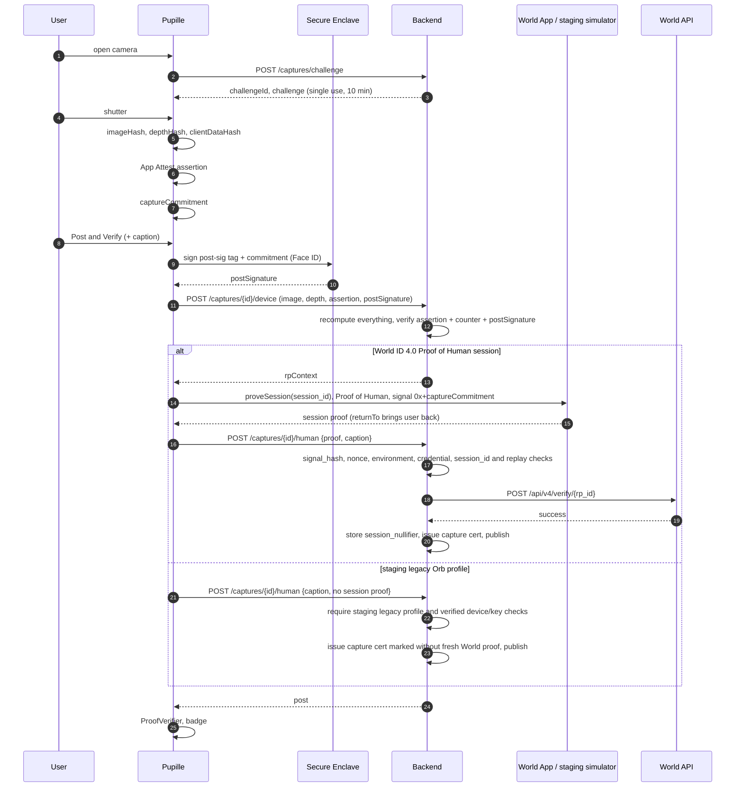
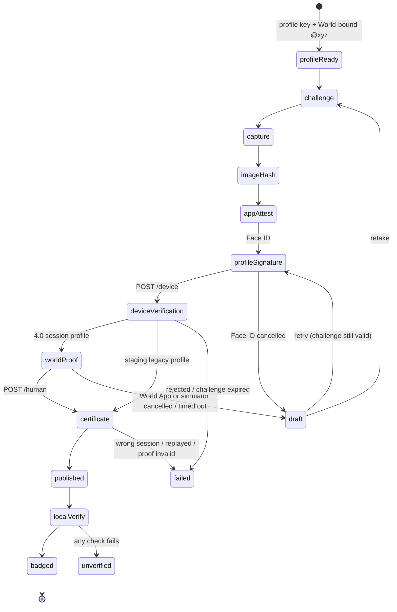

<!-- Pupille architecture and World ID credential policy. -->

ETHGlobal Tokyo 2026 · World · Best Use of IDKit

# Pupille: verify who published a photo, and how it was captured

> **World ID policy:** Pupille requires Orb-backed Proof of Human. Production uses the World ID 4.0 `proofOfHuman` preset for profile uniqueness and, when supported by the installed SDK and World App, a Proof of Human session for each post and key rotation. The no-Orb demo uses a **Human test identity** in [World's staging simulator](https://simulator.worldcoin.org/) and verifies the staging proof through World. If the simulator's browser flow only supports legacy Orb proofs, the staging demo can use `orbLegacy` for profile creation; it must omit per-post World-session claims and label the proof as staging legacy. A simulator identity is not a production Orb-verified person. See [iPhone testing](IPHONE_TESTING.md#world-testing-without-an-orb).

A black-and-white photo feed for iOS. Anyone can check that a photo passed Pupille's trusted capture flow, and that it was published by the original World-backed pseudonymous author shown on the post.

Captured through Pupille · Genuine app/device attestation · Published by verified human @xyz · Image bytes unchanged

<a id="case"></a>

## 00 · The case for the prize

World's brief asks for IDKit at a genuine trust moment, with the minimum credential that covers it. Pupille uses IDKit at the two moments where trust is created: **claiming a pseudonym** and **publishing a photo**.

> **Pitch in one line:** "Pupille is a photo feed where anyone can cryptographically verify that a photo passed Pupille's trusted capture flow, and that it was published by the original World-backed pseudonymous author shown on the post."

### Where we're strongest against the brief

| World asks for | Where most teams stop | What Pupille does |
|----|----|----|
| **A genuine trust moment** | A "verify you're human" gate at sign-up | **Creating @xyz**: an Orb-backed Proof of Human uniqueness proof binds a person to that pseudonym and public key. **Publishing**: a Proof of Human session proof binds the same World ID to that photo when the 4.0 session flow is available. |
| **A credential that covers the claim** | A generic personhood gate | **Proof of Human.** Pupille promises one profile per unique Orb-verified person, so a weaker Selfie Check is insufficient. The choice is explained in [§16](#prize). |
| **Server verification** | A proof checked only in the app | Every proof is verified by the backend through World's API, **against a signal the server computed itself**. |
| **Success plus an alternative scenario** | One contrived error screen | Cancel in the World App → the post stays a draft and never publishes. Also covered: a second profile for the same human is refused, a handle is taken, a proof from a different human doesn't match the profile, and a tampered or re-attributed photo loses its badge on every phone. |
| **Integration feedback** | A paragraph written at 8 AM | A friction log kept with timestamps from hour one ([§17](#feedback)). |

### What makes the use of IDKit distinctive

- **The signal binds a human to a key.** At profile creation the signal commits to `profileId`, the Secure Enclave public key and the handle. World ID doesn't just say "a human verified." It says "a human stands behind this exact key and name."
- **Authorship doesn't depend on our server.** Every photo is signed by the author's own Secure Enclave key. Any iPhone checks that signature itself. The server can't forge it.
- **It uses World ID 4.0 as designed.** A Proof of Human uniqueness nullifier is consumed when a profile is created. A Proof of Human `session_id` can provide continuity on posts and key rotations. Sessions require a 4.0 proof; a staging legacy Orb proof alone cannot establish one.
- **Signals are raw bytes.** Each commitment is passed as a `0x` hex signal, which IDKit hashes as bytes. The backend recomputes the `signal_hash` and checks it before calling World's verify API.
- **Layered trust, as in ZCAM:** media binding (hashes), device (App Attest), author (profile key), human (World ID). They're chained in one commitment, so no layer can be swapped out.

### Against ETHGlobal's judging criteria

| Criterion | Our answer |
|----|----|
| Technicality | Secure Enclave profile keys, App Attest checked on the server, World proofs bound to commitments, a byte-exact protocol with test vectors, a certificate chain verified on every phone |
| Originality | Signed-camera projects prove the device. Pupille also proves the author: a pseudonymous, World-backed identity that owns a hardware key. |
| Practicality | A real problem (AI images and impersonation in feeds), a familiar interface, one Face ID and one World App approval per post |
| User experience | Native SwiftUI with Liquid Glass. All the cryptography is compressed into one glyph and one sheet. |
| WOW factor | Live on two phones: flip one byte and the badge breaks. Relabel a post as another author and it breaks. Copy a certificate onto another photo and it breaks. |

### Say the limits before a judge does

App Attest doesn't prove where the photons came from. The backend vouches for the profile binding and the App Attest checks. Production Proof of Human depends on real Orb enrollment; a staging Human identity only tests the integration. Each limit has a stated answer on this page ([§15](#threats), [§20](#future)).

<a id="badge"></a>

## 01 · What the badge proves

These are the four lines in the VerificationSheet, plus one optional line. For each: what backs it, and who has to be trusted.

| Sheet line | Mechanism | Trust | Tier |
|----|----|----|----|
| **Captured through Pupille** | Single-use server challenge before the shutter. Camera-only path with no Photo Library import. | Pupille issuer | `must` |
| **Genuine app/device attestation** | App Attest key attested by Apple. Per-capture assertion over the image hash and challenge. | Pupille issuer (checked Apple) | `must` |
| **Published by verified human @xyz** | Profile key signature over the capture commitment. The profile certificate binds the key to @xyz and to a verified World Proof of Human uniqueness result. On the 4.0 path, the per-post session proof also carries the profile's `session_id`. | **Signature checked on the phone.** World binding vouched for by the issuer; staging and proof freshness shown explicitly. | `must` |
| **Image bytes unchanged** | `SHA-256(imageBytes)` equals the committed hash | **Checked on the phone, no trust needed** | `must` |
| 3D scene | LiDAR depth hashed into the assertion and the commitment. Flatness recomputed by the backend. | Pupille issuer | `should` |

> **Precise wording, in the style of ZCAM:** App Attest shows that an attested Pupille app instance authenticated this payload. It doesn't prove the photons came straight from an untouched sensor, or that what's shown is true. World ID shows that a unique verified human stands behind @xyz. It doesn't reveal who that human is.

<a id="refine"></a>

## 02 · Refinements to the prompt

The design follows the updated prompt. Where it adds precision, the change and the reason are listed here.

| Prompt says | This design | Why |
|----|----|----|
| "Performs the verification flow in the background" | Everything runs in the background except two visible steps: Face ID (profile signature) and approving in the World App | A World proof requires switching to the World App. Designing that handoff deliberately looks better than hiding it. |
| Assertion over `SHA256("pupille:v1" || imageHash || challenge)` | Tag `pupille:assert:v1`, plus `depthHash` (zeros when absent) | One tag per purpose. Adding LiDAR later then doesn't change the protocol. |
| `captureCommitment` as listed | Same fields in the same order, plus `depthHash` after `imageHash` | Same as above |
| "Sign that commitment" | Sign `"pupille:post-sig:v1" || captureCommitment` | The same key will sign profile changes and future objects. The tag stops a post signature from being reused as any other kind of signature. |
| "World session/continuity proof where supported" | Use `createSession` at profile creation and `proveSession(session_id)` for posts and key rotation **after verifying that the 4.0 Proof of Human path works end to end**. | Sessions cannot use legacy proofs. A staging `orbLegacy` fallback covers profile uniqueness only, so its post flow must state that no fresh World proof was obtained. |
| (not in the prompt) | A uniqueness proof (action `pupille-profile-v1`) when the profile is created, in addition to the session | A session alone gives continuity but not "one profile per World ID." That needs a uniqueness nullifier. |
| (not in the prompt) | Signals are `"0x" + hex(commitment)` | IDKit decodes `0x` hex signals as raw bytes. Without the prefix, the 64 characters would be hashed as text, which is ambiguous. |
| "The public key becomes the permanent identity" | `profileId` is permanent. Keys are versioned. A new iPhone rotates the key with a World proof from the same human. | Secure Enclave keys can't leave the device. Without rotation, a lost phone means a lost profile. |
| Signal includes the handle | The handle is chosen and **reserved** for 10 min before the World proof | The handle has to exist before the signal can commit to it. |

<a id="worldfacts"></a>

## 03 · World ID facts this design relies on

Checked on 26 Sept 2026 against docs.world.org and the IDKit source (`worldcoin/idkit` main, `worldcoin/idkit-swift` 4.0.11). Each row is either quoted from the docs or read in the code.

| Fact | Consequence for Pupille | Source |
|----|----|----|
| **In 4.0, nullifiers are one-time-use per action.** A uniqueness request lets each user complete an action once. Repeats fail with `nullifier_replayed` or `max_verifications_reached`. | A per-post proof can't reuse the same action. The earlier "one action, same nullifier" design wouldn't work. | [4.0 migration](https://docs.world.org/world-id/4-0-migration), [error codes](https://docs.world.org/world-id/idkit/error-codes) |
| **Proof of Human is backed by Orb enrollment.** The current preset is `proofOfHuman`; `orbLegacy` requests an older Orb proof. | Require Proof of Human in production. Use `orbLegacy` only as a staging compatibility fallback, with a different claim on per-post freshness. | [Credentials](https://docs.world.org/world-id/idkit/credentials), [Proof of Human](https://docs.world.org/world-id/credentials/1) |
| **`session_id` is the stable link across 4.0 requests.** Create a session once, save it to the account, then prove that same session on later checks. `session_nullifier` (`[nullifier, action]`) is per-proof replay protection, not an account ID. | On the 4.0 path, profile creation → `createSession` with Proof of Human; every post → `proveSession(savedSessionId)` with the same credential. Reject reused session nullifiers. | [Session proofs](https://docs.world.org/world-id/idkit/session-proofs) |
| **Sessions do not support legacy proofs.** | Never pretend that an `orbLegacy` staging identity completed a per-post World session. Its posts are authorized by the Orb-bound profile key and device checks, and the badge states the earlier staging proof. | [Session proofs](https://docs.world.org/world-id/idkit/session-proofs) |
| Session requests carry presets (and signals). Their RP signature is made **without an action** (49-byte message). | The backend calls `signRequest({signingKeyHex})` with no action for sessions, and with an action for the uniqueness proof | [RP signatures](https://docs.world.org/world-id/idkit/signatures), `rust/core/src/bridge.rs` |
| **Signal encoding:** a string that is `0x` + even-length hex is decoded to raw bytes. Anything else is hashed as UTF-8 text. `signal_hash = keccak256(bytes) >> 8`. | Signals are `"0x" + hex(commitment)`. Signal-hash test vectors are in §06. | `rust/core/src/types.rs`, RP signatures page |
| **The verify API does not take an expected signal.** It checks the proof against the `signal_hash` inside the result. IDKit computes it, and the RP must not reshape the payload. | The backend must compare each response's `signal_hash` with `hashSignal(expected)` *itself*, then forward the unchanged result to `/api/v4/verify/{rp_id}`. | [Verify API](https://docs.world.org/api-reference/developer-portal/verify) |
| The full IDKit result, including its credential identifier, must reach World verification unchanged. | Check the expected environment, action, nonce, signal, credential and nullifier before issuing a profile or capture certificate. Store the uniqueness nullifier atomically. | [IDKit integration](https://docs.world.org/world-id/idkit/integrate) |
| IDKit supports `return_to` (a deep-link callback URL) | `returnTo: "pupille://world-done"` brings the user straight back after they approve | JS and Swift references |
| The Swift SDK documents staging simulator testing and a legacy Orb request. The exact 4.0 Proof of Human session surface must be checked against the installed Swift version before coding. | Prefer the supported Swift API; if it lacks the needed 4.0 session wrapper, use the public generated bindings or drive IDKit from the backend. Do not claim the path works until a staging proof verifies. | [Swift SDK](https://github.com/worldcoin/idkit-swift), [IDKit integration](https://docs.world.org/world-id/idkit/integrate) |
| Testing: `environment: .staging` with simulator.worldcoin.org and a Human test identity. The simulator repository also documents native 4.0 staging Proof of Human via its MCP. | Test the actual iPhone-to-browser handoff before relying on it for the live demo. Production requests and production proofs must stay separate. | [IDKit integration](https://docs.world.org/world-id/idkit/integrate), [simulator](https://github.com/worldcoin/simulator) |

<a id="overview"></a>

## 04 · System overview



### Chain of trust for one post

`image bytes → captureCommitment → App Attest assertion → profile key signature → profile cert: key ↔ @xyz ↔ Proof of Human → World session proof (4.0 path)`

The commitment includes the image hash, depth, challenge, assertion hash, `profileId` and the profile public key. So each later link covers everything before it.

<a id="identity"></a>

## 05 · Profiles as keys

A profile is a cryptographic identity, not a username row. The public handle is private about the person behind it.

- **profileId**: 16 random bytes, generated on the phone at creation. Permanent: it survives key rotation.
- **Profile key**: Secure Enclave P-256, non-exportable, Face ID to sign. It signs posts, auth challenges and future profile changes. It's versioned.
- **@handle**: Claimed once, immutable for the MVP. `^[a-z0-9_]{3,20}$`, case-insensitive unique. It's inside the World signal, so it's bound to the human.
- **Profile certificate**: Issuer-signed: profileId, handle, key, key version, credential, proof digest. There's one per key version, and it travels with every post.

### How World ID attaches to a profile

| World primitive | When | Signal | Stored | Gives us |
|----|----|----|----|----|
| `proofOfHuman` uniqueness proof, action `pupille-profile-v1` | Once, when the profile is created | `0x` + profileCommitment | Nullifier (`NUMERIC(78,0)`, unique), credential and environment | One profile per Orb-backed World ID |
| `createSession` with Proof of Human | Once, on the 4.0 profile path | `0x` + profileCommitment | `session_id` on the profile | The anchor for continuity |
| `proveSession(session_id)` with Proof of Human | Every post on the 4.0 path | `0x` + captureCommitment | `session_nullifier` (replay table) | The same World ID that created @xyz approved this exact photo |
| `proveSession(session_id)` + `require_user_presence` | Key rotation on the 4.0 path | `0x` + new profileCommitment | New key version | Moving the profile to a new device |
| `orbLegacy` uniqueness proof | Staging fallback only | `0x` + profileCommitment | Legacy nullifier, staging credential | Tests a Human identity without a 4.0 session; later posts use the bound profile key, not a fresh World proof |

### Rules

- **One profile per Orb-backed World ID.** A second uniqueness proof from the same World ID has the same action-scoped nullifier or is rejected by World. The backend refuses another profile with `409 one_profile_per_human` and does not rely on a client-side success flag.
- **Continuity comes from `session_id`, never the uniqueness nullifier.** Replacing a profile's 4.0 session is a security operation. It requires proof of the existing session.
- **New iPhone = key rotation on the 4.0 path.** A proof of the saved session over a new profileCommitment (same profileId and handle, new key) activates key version `n+1` and retires `n`. Old posts stay valid. The legacy staging fallback does not support this rotation flow.
- **A passkey is optional and separate:** for login or recovery later, never as the authorship key.

<a id="spec"></a>

## 06 · Protocol byte spec

Swift and TypeScript must build byte-identical inputs. Both must pass the test vectors before anything is built on top.

### Conventions

- `H` = SHA-256. Hashes are **raw 32 bytes** as inputs. Use hex only in JSON and in IDKit signals (lowercase).
- `||` = concatenation. Tags are ASCII with no terminator. Every field is fixed-length except `handle`, which always comes last.
- `challenge` = 32 random bytes. `profileId` = 16 bytes. `profilePublicKey` = 65-byte X9.63 (`0x04 || X || Y`, CryptoKit `x963Representation`). `handle` = lowercase UTF-8, without "@".
- Profile signatures are ECDSA P-256 with SHA-256, **raw r‖s 64 bytes** (`P256.Signing.ECDSASignature.rawRepresentation`). Node verifies with `crypto.verify("sha256", message, {key, dsaEncoding: "ieee-p1363"}, sig)`. Both sides hash the message themselves, so pass the tagged message and never a pre-computed digest.
- Public key conversion in Node: X9.63 → JWK `{kty:"EC", crv:"P-256", x: b64url(bytes 1–32), y: b64url(bytes 33–64)}` → `crypto.createPublicKey({key: jwk, format: "jwk"})`.

### Derivations

```text
// profile creation / key rotation
profileCommitment = H("pupille:profile:v1" || profileId || profilePublicKey || handle)
profileSignal     = "0x" + hex(profileCommitment)                           // IDKit signal (decoded as 32 raw bytes)
profilePoP        = Sign(profileKey, "pupille:profile-sig:v1" || profileCommitment)   // proves key possession

// per capture
imageHash         = H(imageBytes)
depthHash         = H(depthBytes)  or  32 zero bytes
clientDataHash    = H("pupille:assert:v1" || imageHash || depthHash || challenge)
assertion         = DCAppAttestService.generateAssertion(keyId, clientDataHash)
assertionHash     = H(assertion)
captureCommitment = H("pupille:capture:v1" || imageHash || depthHash || challenge
                      || assertionHash || profileId || profilePublicKey)
postSignature     = Sign(profileKey, "pupille:post-sig:v1" || captureCommitment)
worldSignal       = "0x" + hex(captureCommitment)                           // IDKit signal (raw bytes)

// World side (IDKit computes this; the backend must recompute and compare)
signal_hash       = "0x" + hex( uint256(keccak256(signalBytes)) >> 8 )      // = IDKit.hashSignal(signal)

// auth
authSignature     = Sign(profileKey, "pupille:auth:v1" || authChallenge)
worldProofHash    = H(exact bytes of the verified IDKit result JSON)         // for requests that produced a World proof
```

Hashing is SHA-256 on our side and Keccak-256 on World's (`hash_to_field`). Use `IDKit.hashSignal` (Swift) or `hashSignal` from `@worldcoin/idkit-core/hashing` (Node) instead of writing your own. The `signal_hash` vectors below were checked against World's published `hash_to_field` vectors.

### Test vectors

Inputs: `imageBytes` = ASCII `pupille-test-image`, `depthBytes` = ASCII `pupille-test-depth`, `challenge` = `00 01 … 1f`, `assertion` = ASCII `pupille-test-assertion`, `profileId` = `40 41 … 4f`, `profilePublicKey` = `04` followed by 64 × `11`, `handle` = `xyz`.

| Value | Expected (hex) |
|----|----|
| `profileCommitment` | `cb3dfa39b9aa0a69953457ddeccccce2d5e525616cceaa1371f525976bc3afcb` |
| `imageHash` | `4e7044f1193044743df1880194fab538d607d219408c1092ff77eb45a2eaf665` |
| `depthHash` | `5415cfd0583130a6191c532073f346d78d58a0ee528a04d0f231838e3224e241` |
| `clientDataHash` | `653cc83bc26205563b5635f4e5b644186cdf50c4a49893af86b1219615c2bb27` |
| `assertionHash` | `8f7fe9bf38c364dfbcf08aef9005b5d7b76d6f491f02c8831bb082d681f15bde` |
| `captureCommitment` | `9e4351a4e2c238fb74d470a06201f16f7798670d8a9404e03aec14bf7e5f3b81` |
| `clientDataHash` (no depth) | `3ef26e74876b28c66a4fd26c3eed63ce6256beaed8d9ee1edf4ea1bd0718a13c` |
| `captureCommitment` (no depth) | `cd4318a78cb7b8a68841b97407f51164b3db7ad06864f94acdf258a7d9bd35a8` |
| `signal_hash` of `profileSignal` | `0x004f635db677ba0a89f2b6fda2cb0e24ce391aefa22dc757f438aa73946d0cbe` |
| `signal_hash` of `worldSignal` | `0x006641a703b91c4d6ba5165df85946f44a05d182a9fdaf15c78981858362f9c8` |
| `signal_hash` of `worldSignal` (no depth) | `0x0053d9d11c6f8f38ae17fd5a7e2696f1cbe69b57b74559454e3afbd992b1ebc3` |

ECDSA signatures are randomized, so they have no fixed vector. Test them with a round trip instead: Swift signs, Node verifies, and Node rejects the same signature over a modified commitment.

<a id="profileflow"></a>

## 07 · Flow: create @handle

First launch attests the App Attest key once (challenge → `attestKey` → `/attest/register`). On the 4.0 path, creating a profile takes two World approvals: a Proof of Human uniqueness request and a Proof of Human session request. With `returnTo`, each one brings the user back. The staging legacy fallback completes only the uniqueness request; it does not create a session.



**Backend checks, in order:** reservation valid → each response's `signal_hash == hashSignal("0x"+profileCommitment)` → nonce/action/environment match the request → World verify succeeds with Proof of Human (or a staging-only legacy Orb identifier) → nullifier has not been used (otherwise return `409 one_profile_per_human`) → `profilePoP` is valid under the submitted key → App Attest assertion over `H("pupille:profile-assert:v1" || profileCommitment)` → store the verified credential, environment and, on the 4.0 path, `session_id`. The uniqueness insertion and profile creation must be atomic.

**Key rotation (new iPhone):** on the 4.0 path, the user enters their handle and a new key is created. `proveSession(saved session_id)` runs with `require_user_presence` and the new profileCommitment as the signal. The backend checks that `session_id` matches the profile, then issues key version `n+1`. A staging legacy profile has no session and cannot use this recovery path.

**Failure screens, mapped to IDKit codes:** `user_rejected` / `cancelled` → "You cancelled in World ID. @xyz isn't created yet." · `credential_unavailable` → "This flow needs Orb-backed Proof of Human." · `user_presence_failed` · `timeout` · `rp_signature_expired` → retry with a fresh context · `409 one_profile_per_human` → "You already have a profile" · `handleTaken` · `reservationExpired` · `attestUnsupported`.

<a id="post"></a>

## 08 · Flow: Post & Verify

The protected action is **publishing**. If any step fails, nothing reaches the feed.



### State machine (`ProofCoordinator`)



- **Cancelling the World approval is the 4.0 demo's alternative scenario.** The post stays a local draft: "Not posted — approve in World ID to publish." On the staging legacy fallback, demonstrate cancellation during profile creation instead; there is no per-post World approval.
- The backend recomputes `imageHash`, `depthHash`, `clientDataHash` and `captureCommitment` from its own stored challenge and the active profile key. It never accepts a hash from the client.
- Assertion check: signature over `H(authenticatorData || clientDataHash)` under the stored key, `rpIdHash == H(appId)`, counter greater than the stored counter.
- On the 4.0 path, World checks on `/human` are: `signal_hash == hashSignal("0x"+captureCommitment)` → nonce/environment/credential match → `session_id == profile.session_id` → `session_nullifier` not seen before → forward the unchanged result to `/api/v4/verify/{rp_id}` → store the session nullifier. On the staging legacy path, `/human` must explicitly reject a claimed fresh World proof and issue a certificate with no per-post World proof digest.
- The RP context for the session proof is signed **without an action**. Every request gets a fresh nonce, since World rejects `duplicate_nonce`.
- To post you need a session token, the device's App Attest key and the profile key (Face ID). The 4.0 path additionally requires a session proof from the World ID that created the profile. A stolen token alone cannot post.

<a id="feed"></a>

## 09 · Flow: feed verification

`ProofVerifier` is a pure function that runs on every post before `PostView` draws the glyph. It never trusts a `verified` field from the server.

| \# | Check | Catches |
|----|----|----|
| 1 | Profile cert: Ed25519 signature under the pinned issuer key, `v`, `uniquenessAction`, `credential`, `environment`, `worldSession` | Forged profile or misrepresented staging credential |
| 2 | `profileCert.publicKey == post.authorPublicKey`, `profileCert.handle == post.handle`, `profileId` matches | **Swapped author** |
| 3 | Capture cert: signature under the pinned key, `v`, `appId`, `profileId` and `keyVersion` match the profile cert | Forged or mismatched cert |
| 4 | `H(downloaded bytes) == captureCert.imageSha256`, and the same for depth | **Edited image, certificate copied onto another image** |
| 5 | Recompute `captureCommitment` from the cert fields and the profile key. It must equal `captureCert.captureCommitment`. | Inconsistent cert |
| 6 | `postSignature` verifies under `profilePublicKey` over `"pupille:post-sig:v1" || captureCommitment` | **Authorship forged by anyone, including the server** |
| 7 | Optional: `H(caption) == captureCert.captionSha256` | Edited caption |

`PostView` states: `verifying` (no glyph), `verified` (glyph, tap opens the sheet), `unverified(reason)` (explicit crossed-out glyph). The three demo attacks are one byte flipped, author relabelled, and a certificate copied onto another image. They fail checks 4, 2/6 and 4 respectively.

The signature checks prove the certificates came from Pupille's issuer. They do not independently query World. The sheet reads the issuer-signed `credential`, `environment`, `worldSession` and capture proof digest so a staging or legacy result cannot silently appear as a production, fresh Proof of Human result.

> **Serve exact bytes.** No CDN resizing, recompression or metadata stripping. Make thumbnails on the phone.

<a id="certs"></a>

## 10 · Certificates and post payload

Both certificates are JSON signed once by the issuer's Ed25519 key, then kept and sent as exact bytes (`certB64` + `sigB64`). They're never re-serialized.

- ```text
// Profile certificate (one per key version)
{
  "v": 1,
  "type": "profile",
  "issuer": "pupille-backend-1",
  "profileId": "404142…4f",
  "handle": "xyz",
  "keyVersion": 1,
  "publicKey": "BBER…",            // base64 X9.63
  "credential": "proof_of_human",
  "environment": "staging",
  "uniquenessAction": "pupille-profile-v1",
  "worldSession": true,          // false for the staging legacy fallback
  "profileCommitment": "cb3dfa39…",
  "worldProofSha256": "…",         // verified profile uniqueness proof
  "appAttestKeyId": "…",
  "validFrom": "2026-09-26T09:02:11Z"
}
```

  ```text
// Capture certificate (one per post)
{
  "v": 1,
  "type": "capture",
  "issuer": "pupille-backend-1",
  "postId": "01J8Z…",
  "appId": "ABCDE12345.app.pupille",
  "profileId": "404142…4f",
  "keyVersion": 1,
  "imageSha256": "4e7044f1…",
  "depthSha256": "5415cfd0…",
  "flatness": 0.0831,
  "captionSha256": null,
  "challenge": "000102…1f",
  "assertionSha256": "8f7fe9bf…",
  "captureCommitment": "9e4351a4…",
  "worldProofSha256": "…",         // null for a staging legacy post without a fresh World proof
  "challengeIssuedAt": "…",
  "certifiedAt": "…"
}
```

```text
// Post as returned by GET /v1/feed
{ "id": "01J8Z…", "imageUrl": "/v1/posts/01J8Z…/image", "caption": null,
  "author": { "handle": "xyz", "profileId": "…", "publicKey": "BBER…" },
  "postSignature": "base64 r‖s",
  "profileCert":  { "certB64": "…", "sigB64": "…" },
  "captureCert":  { "certB64": "…", "sigB64": "…" },
  "depthUrl": null, "createdAt": "…" }
```

Neither the nullifier nor the `session_id` appears in a certificate. They stay on the server. Certificates record the verified credential, environment and proof digests. The backend derives `credential` from World's verified response (`proof_of_human` / schema `1`, or the legacy Orb identifier); it never trusts a client-supplied label. The VerificationSheet must display **Staging Human** for simulator identities and must say **No fresh World proof for this post** when the staging legacy fallback is used.

<a id="ios"></a>

## 11 · iOS app

SwiftUI with Liquid Glass (iOS 26 SDK): edge-to-edge photos, monochrome type, glass tab bar and sheets. The only color is the glyph's state.

### Views

| View | Contents |
|----|----|
| `CreateProfileView` | Pick @handle (live availability) → "Prove you're unique" (World App) → "Link World ID to @xyz" (World App) → Face ID → done. Failure and "you already are @abc" screens. Also the "Move @xyz to this iPhone" rotation entry. |
| `FeedView` | Global vertical feed, newest first, pull to refresh |
| `CameraView` | Full-screen `AVCaptureSession`. The challenge is fetched on appear. No library button. |
| `CapturePreviewView` | Minimal preview, caption field, **Post & Verify**, retake |
| `PostView` | Full-width image, @xyz, timestamp, optional caption, glyph in the bottom-right corner |
| `VerificationSheet` | Glass sheet with the four guarantees, each checked. Expandable details: key fingerprint, hashes, times, credential. |
| `ProfileView` | @xyz, key fingerprint, credential, grid of your own posts, unposted drafts |

### Services

| Service | Job | APIs |
|----|----|----|
| `CameraService` | Session and capture. Returns encoded bytes (and depth if available). | `AVCapturePhotoOutput` |
| `CaptureHasher` | Every derivation in §06. The test vectors live here. | CryptoKit `SHA256` |
| `AppAttestService` | Creates and attests the key on first launch. Makes assertions. | `DCAppAttestService` |
| `ProfileKeyService` | Creates and loads the profile key and signs tagged messages. Exposes the public key and fingerprint. | `SecureEnclave.P256.Signing.PrivateKey`, `SecAccessControl(.privateKeyUsage, .biometryCurrentSet)` |
| `WorldIDService` | `proveUnique(signal:)`, then `createSession(signal:)` and `proveSession(id:signal:)` on the 4.0 Proof of Human path. Opens World App in production or shows a connector URL for the staging simulator, polls, and maps IDKit errors. | IDKit Swift 4.x; generated bindings if required |
| `ProofCoordinator` | Owns the profile-creation and Post & Verify state machines | `@Observable`, Swift concurrency |
| `ProofVerifier` | Checks 1–7 from §09. Pure and unit-tested. | CryptoKit `P256`, `Curve25519` |
| `FeedService` | Fetches posts and exact bytes, runs the verifier, publishes `[Post]` | `URLSession` |
| `ProfileStore` | Current profile, key version, own posts, drafts | SwiftData, Keychain |
| `APIClient` | Typed endpoints, session token | `URLSession` |

### `WorldIDService` on IDKit Swift 4.x

Start with the public `proofOfHuman` preset and `environment: .staging` for the simulator. Check the installed Swift package for its current 4.0 session API before coding; use its public generated bindings if the wrapper still lacks the session methods. Conceptual sketch:

```text
import IDKit

func proofOfHuman(_ signal: String) -> ConstraintNode { // signal = "0x" + hex(commitment)
  .item(request: .withStringSignal(credentialType: .proofOfHuman, signal: signal))
}

// Session proof for a post (createSession is identical via IdKitBuilder.fromCreateSession)
let cfg = IdKitSessionConfig(appId: appId, packageName: "app.pupille", packageVersion: "1.0",
                             rpContext: rpContext, actionDescription: nil, bridgeUrl: nil,
                             requireUserPresence: false, overrideConnectBaseUrl: nil,
                             returnTo: "pupille://world-done", environment: .staging)
let req = try IdKitBuilder.fromProveSession(sessionId: savedSessionId, config: cfg)
                          .constraints(constraints: proofOfHuman(worldSignal))
await UIApplication.shared.open(URL(string: req.connectUrl())!)
// poll req.pollStatusOnce() → .confirmed(result:) | .failed(error:) → send result JSON to backend unchanged
```

This sketch is a design contract, not copy-ready Swift: check the exact generated type and initializer names when installing IDKit. Uniqueness proofs use the `pupille-profile-v1` action. The full 4.0 path disallows legacy proofs because sessions cannot use them. A staging-only fallback uses the documented `orbLegacy` preset for the uniqueness request and does not invoke session methods.

### Model

```text
struct Post: Identifiable {
  let id: String
  let imageData: Data                 // exact bytes as downloaded
  let caption: String?
  let authorHandle: String
  let authorPublicKey: Data           // 65-byte X9.63
  let postSignature: Data             // 64-byte r‖s
  let profileCertificate: SignedBlob  // exact bytes + Ed25519 sig
  let captureCertificate: SignedBlob
  var verification: VerificationState // .verifying | .verified | .unverified(Reason)
}
```

Setup: `NSCameraUsageDescription`, `NSFaceIDUsageDescription`, the App Attest entitlement (`development`, which changes the expected AAGUID), and the Keychain. Run on a physical iPhone with iOS 26, since the Secure Enclave and App Attest don't run in the Simulator.

<a id="backend"></a>

## 12 · Backend

TypeScript (Hono) + Postgres on Railway or Fly. Images are stored as `bytea`, which is fine at demo scale. The API and schema below describe the target Proof of Human implementation. The currently checked-in backend still expects the earlier session-only profile shape and fixture World result; update it before a live staging proof test.

### API

| Endpoint | Auth | Does |
|----|----|----|
| `POST /v1/attest/challenge`, `/v1/attest/register` | none | Attests the App Attest key: Apple chain, nonce, appId, AAGUID. Stores the key with counter 0. |
| `GET /v1/handles/:h` | none | Checks availability |
| `POST /v1/profiles/start` | attested key | Reserves the handle for 10 min and stores profileId and key. Returns `rpContext` signed **with** action `pupille-profile-v1`. |
| `POST /v1/profiles/unique` | reservation | Proof of Human uniqueness result: signal, nonce, action, environment, credential, World verification and unused nullifier. On the 4.0 path returns an `rpContext` signed **without** an action for the session. On the staging legacy fallback, proceed without a session. |
| `POST /v1/profiles/complete` | attested key + PoP | On the 4.0 path verify a Proof of Human `createSession` result and store `session_id`; on staging legacy require the prior verified Orb uniqueness result. Check PoP and assertion. Return profile cert and app session token with accurate credential/environment/session fields. |
| `POST /v1/profiles/rotate` | new key PoP | 4.0 Proof of Human `proveSession` result over the new profileCommitment. `session_id` must match the profile. Return cert v(n+1). Unavailable for staging legacy profiles. |
| `POST /v1/auth/challenge` → `/v1/auth/token` | profile key | Session token from a signed challenge |
| `POST /v1/captures/challenge` | session | Single-use challenge (10 min), bound to the profile, key version and App Attest key |
| `POST /v1/captures/:id/device` | session | Multipart image, depth, assertion and post signature. Recomputes everything and checks the assertion, counter and signature. Returns `rpContext`. |
| `POST /v1/captures/:id/human` | session | For a 4.0 profile, require a Proof of Human session proof with matching signal/nonce/environment/session ID and unused session nullifier, then World verification. For a staging legacy profile, require device/key checks and issue a certificate explicitly marked without a fresh World proof. Publish only after the applicable checks. |
| `GET /v1/feed` | none | Post payloads (§10) |
| `GET /v1/posts/:id/image` | none | Exact bytes |
| `GET /v1/profiles/:handle` | none | Profile certs for every key version, and the posts |

### Schema

```text
create extension if not exists citext;

create table profiles (
  id          bytea primary key,                 -- 16-byte profileId
  nullifier   numeric(78,0) unique not null,     -- uniqueness proof (pupille-profile-v1); never leaves the server
  session_id  text unique,                       -- 4.0 Proof of Human continuity; null for staging legacy
  handle      citext unique not null check (handle ~ '^[a-z0-9_]{3,20}$'),
  credential  text not null,                    -- verified proof_of_human or staging legacy Orb
  environment text not null check (environment in ('staging', 'production')),
  created_at  timestamptz not null default now()
);

create table profile_keys (
  profile_id   bytea not null references profiles(id),
  key_version  int not null,
  public_key   bytea unique not null,           -- 65-byte X9.63
  status       text not null default 'active',  -- active | retired
  cert         bytea not null, cert_sig bytea not null,
  activated_at timestamptz not null default now(), retired_at timestamptz,
  primary key (profile_id, key_version)
);
create unique index one_active_key on profile_keys(profile_id) where status = 'active';

create table profile_sessions (                 -- handle reservation + pending proof
  id text primary key, profile_id bytea not null, public_key bytea not null,
  handle citext not null, app_attest_key_id text not null,
  expires_at timestamptz not null, used boolean not null default false
);

create table world_session_nullifiers (         -- per-proof replay protection
  nullifier numeric(78,0) not null, action text not null,
  used_at timestamptz not null default now(), primary key (nullifier, action)
);

create table app_attest_keys (
  key_id text primary key, public_key bytea not null, receipt bytea,
  counter bigint not null default 0, created_at timestamptz not null default now()
);

create table capture_challenges (
  id text primary key, challenge bytea not null,
  profile_id bytea not null, key_version int not null, app_attest_key_id text not null,
  image_sha256 bytea, depth_sha256 bytea, assertion_sha256 bytea,
  commitment bytea, post_signature bytea, world_proof jsonb,
  status text not null default 'issued',          -- issued | device_ok | used | expired
  issued_at timestamptz not null default now(), expires_at timestamptz not null
);

create table posts (
  id text primary key,
  profile_id bytea not null, key_version int not null,
  challenge_id text unique not null references capture_challenges(id),
  image bytea not null, content_type text not null, depth bytea, caption text,
  post_signature bytea not null, capture_cert bytea not null, capture_cert_sig bytea not null,
  created_at timestamptz not null default now(),
  foreign key (profile_id, key_version) references profile_keys(profile_id, key_version)
);
```

> **Two easy hours to lose:** App Attest CBOR parsing (use an existing Node library and test against a real device early), and ECDSA encoding (CryptoKit's raw r‖s needs `ieee-p1363` in Node, and the X9.63 public key has to be converted to a JWK or SPKI key object).

<a id="secrets"></a>

## 13 · Keys and secrets

| Key | Lives in | Signs |
|----|----|----|
| Profile key (P-256), versioned | Secure Enclave, non-exportable, Face ID. Public key in the profile cert. | Posts, profile PoP, auth challenges |
| App Attest key (P-256) | Secure Enclave, per install. Public key stored by the backend. | Assertions |
| Issuer key (Ed25519) | Backend environment. Public key pinned in the app. | Profile and capture certificates |
| RP signing key | Backend environment | IDKit `rpContext` |
| Session secret | Backend environment | Session tokens |

<a id="privacy"></a>

## 14 · Privacy model

| Party | Knows | Doesn't know |
|----|----|----|
| Anyone in the feed | @xyz, profile public key, credential level, photos, time windows | Real name, face, nullifier, session ID |
| Pupille backend | Nullifier ↔ profile ↔ keys ↔ posts | Real name, face, biometrics |
| World | That proofs were made for Pupille's action | Handle, key, photos. It only sees opaque 64-character signals. |
| Other World ID apps | Nothing. Nullifiers are scoped per app and action. | Everything |

<a id="threats"></a>

## 15 · Threat model

| Attack | Mitigation | What's left |
|----|----|----|
| Edit the image | Hash check on every phone | None |
| Copy a certificate onto another image | The image hash is in the certificate and the signed commitment | None |
| Relabel a post as another author | Profile key signature over a commitment that contains that key. Profile cert binds the key to the handle. | None |
| The server forges a post as @xyz | It can't produce `postSignature` without the Secure Enclave key | A malicious server could issue a false *profile cert* for a new key. Later: a public key-transparency log. |
| Post an AI image through the app | Camera-only path. App Attest proves an unmodified app. | A compromised device injecting frames |
| Photograph a screen | LiDAR flatness (should-have) | Stated openly |
| Farm profiles or take over a handle | Orb-backed Proof of Human uniqueness nullifier; 4.0 rotation and posting require the profile's `session_id`. | A simulator Human identity is staging-only and cannot establish production uniqueness. A legacy staging profile has no session-based recovery or fresh World proof on posts. |
| Replay a World proof, challenge or assertion | Signal = commitment (checked through `signal_hash`). Fresh RP nonce per request. `session_nullifier` replay table. Single-use challenge. Increasing App Attest counter. | None |
| Stolen phone | Face ID on the profile key. The owner rotates the key from a new phone, which retires the old one. | Posts signed before the rotation stay valid |
| Another person enrolled in the phone's Face ID | None at the protocol level | Stated limitation. The 4.0 per-post World proof adds an approval; staging legacy posts do not have that step. |

<a id="prize"></a>

## 16 · Prize checklist: Best Use of IDKit

| Requirement | How we meet it | Evidence |
|----|----|----|
| IDKit in a working app | IDKit Swift in a native iOS app: Proof of Human uniqueness and, if the 4.0 staging flow works end to end, Proof of Human sessions at profile creation and on posts/key rotation. | Live demo and verified backend result, not the device lab alone. |
| A credential with server verification | Orb-backed Proof of Human. Every accepted proof is verified via `/api/v4/verify/{rp_id}` against a server-computed signal, action and expected environment. | `/profiles/unique`, `/profiles/complete`, `/captures/:id/human` as applicable. |
| Explain the trust moment and credential | A pseudonym claims one unique Orb-backed human; a 4.0 session can authorize a specific photo. A staging simulator tests this path without an Orb visit. | First 30 seconds of video and VerificationSheet label. |
| Success plus an alternative scenario | Published with badge / cancelled → draft / second profile refused / different human refused | Demo steps 2, 3, 7 |
| Integration feedback | Log in §17 | README section |

### Why Proof of Human covers the claim

| Credential | Decision | Reason |
|----|----|----|
| Proof of Human (Orb) | `required` | Pupille's one-profile-per-human claim requires the high-assurance unique-human credential backed by Orb enrollment. Use the `proofOfHuman` preset in production. |
| Selfie Check | `not accepted` | It is a weaker camera-based credential and does not establish the Orb-level uniqueness Pupille promises. |
| Passport | `not requested` | Adds nothing to "a human stands behind @xyz" |
| Identity Check | `not requested` | Reveals attributes such as age or nationality. That's over-collection that would break the pseudonymity promise. |
| `require_user_presence` | `rotation, if supported` | A fresh liveness step when moving a profile to a new device. Verify how it interacts with Proof of Human and the staging simulator before enabling it. |

<a id="feedback"></a>

## 17 · Integration feedback log

A required deliverable. Keep one shared `FEEDBACK.md` and write an entry as each thing happens.

```text
## Integration feedback: World IDKit (Swift 4.x)

Time to first success
- HH:MM  started: Developer Portal app + action created
- HH:MM  first staging proof verified by backend      → X h Y min

Friction log   (tag: [docs] [sdk] [portal] [world-app])
- HH:MM  [tag]  what happened, what we tried, what fixed it

Documentation gaps
Highest-impact improvement
```

<a id="plan"></a>

## 18 · Build plan

Deadline Sunday 09:00 JST. Do the riskiest parts first.

| Milestone | iOS | Backend | Tier |
|----|----|----|----|
| M0: De-risk | IDKit Swift Proof of Human uniqueness request with `environment: .staging` and simulator Human identity; then test 4.0 `createSession`/`proveSession` on the same identity. App Attest and Secure Enclave checks already pass on the real phone. | Server signs RP contexts, checks signal/action/nonce/environment/credential, forwards the unchanged result to World, and records the verified nullifier/session. Resolve the live v4 response shape before profile work. | `must, first` |
| M1: Byte spec | `CaptureHasher` passes the vectors | Same in TypeScript | `must` |
| M2: Profiles | `ProfileKeyService`, `CreateProfileView`, failure screens | Attest, handles, profiles start/unique/complete, profile cert, auth | `must` |
| M3: Post & Verify | Camera, preview, `ProofCoordinator`, draft on cancel | Challenge, device, human, capture cert | `must` |
| M4: Feed | `FeedView`, `PostView`, `ProofVerifier`, `VerificationSheet`, `ProfileView` | Feed, image, profile endpoints. Deploy. | `must` |
| M5: Polish + attack demo | Liquid Glass pass, unverified glyph | Admin switches: flip byte, relabel author, copy cert | `should` |
| M6: Depth, rotation | LiDAR flatness. New-iPhone rotation UI. | Flatness, rotation path | `should` |
| Demo readiness | Use a staging app and simulator Human identity on the Mac while Pupille runs on the iPhone. Show **Staging Human** in the UI; dry run on venue Wi-Fi. A production run requires an actual Orb-verified World ID. | (both) | `must` |
| Submit | 2–4 min video (Mac screen capture with the iPhone mirrored), README with AI-usage disclosure and the feedback log, submit with at least 1 hour to spare | (both) | `must` |

**4.0 staging demo script (4 min):** (1) create @xyz with a simulator Human identity and verified Proof of Human uniqueness/session results → (2) take a photo, Post & Verify, cancel the simulator approval → draft → (3) retry: Face ID, approve → post appears with a **Staging Human** glyph → (4) VerificationSheet → (5) second phone checks it → (6) flip one byte or relabel the author → Unverified → (7) try a second profile with the same test identity → refused. If the simulator only completes legacy Orb requests, show the World proof at profile creation and clearly omit steps that need a 4.0 session; posts are signed by the World-bound profile key but have no fresh World proof.

<a id="open"></a>

## 19 · Open questions and fallback

### Answered by the research

- **Can the same human prove one action repeatedly?** A uniqueness action is one-time per World ID. On the 4.0 path, use session proofs for recurring checks.
- **Is there a session or continuity proof?** `createSession` / `proveSession` supply one for 4.0 Proof of Human when the actual Swift + simulator path supports it. Legacy Orb fallback has no session.
- **How is the signal encoded and hashed?** `0x` + hex is decoded to bytes. `signal_hash = keccak256 >> 8`. The backend must compare it itself.
- **Is there an RP signing helper outside JS?** Go has one. For Node, use `signRequest` from `@worldcoin/idkit-core/signing`.
- **Does the verify result report the credential?** Yes: `identifier` and `issuer_schema_id` on each response.

### Still to ask at the World booth

1. Does the simulator browser flow complete World ID 4.0 Proof of Human requests and sessions, as its documented MCP path does? We must test this with Pupille's connector URL.
2. Which installed Swift SDK API supports `proofOfHuman`, `createSession` and `proveSession` today? If only generated bindings do, are they supported for production apps?
3. Can the same World ID create another session for the same RP, and does that yield the same `session_id`? This affects account recovery policy.
4. Can a stored proof be re-verified later through `/api/v4/verify`? If so, published profile proofs could be checked without trusting Pupille's issuer.

> **Fallbacks, in order:** (1) If the Swift 4.0 session wrapper is unavailable, the backend can drive IDKit with `@worldcoin/idkit-core` and return a connector URL to the phone. (2) If the simulator browser flow only completes legacy Orb proofs, use `orbLegacy` in staging for profile uniqueness and omit the per-post World session. The verified Orb-level **staging** profile binding remains; the badge must distinguish it from a fresh per-post approval and from a production Orb credential. Neither fallback accepts Selfie Check for a Proof of Human badge.

<a id="future"></a>

## 20 · Later

- A **key-transparency log** (or onchain registry) of profile certificates, so a malicious server can't quietly issue a new key for @xyz.
- Embed provenance as a **C2PA** manifest.
- A **ZK proof** of the App Attest checks, which hides raw device evidence (ZCAM's direction).
- A passkey for account recovery. Profile-signed edits (bio, avatar) using the same key and a new tag.
- Reserved: a second feature is planned. Every signed object carries `v` and `type`.
