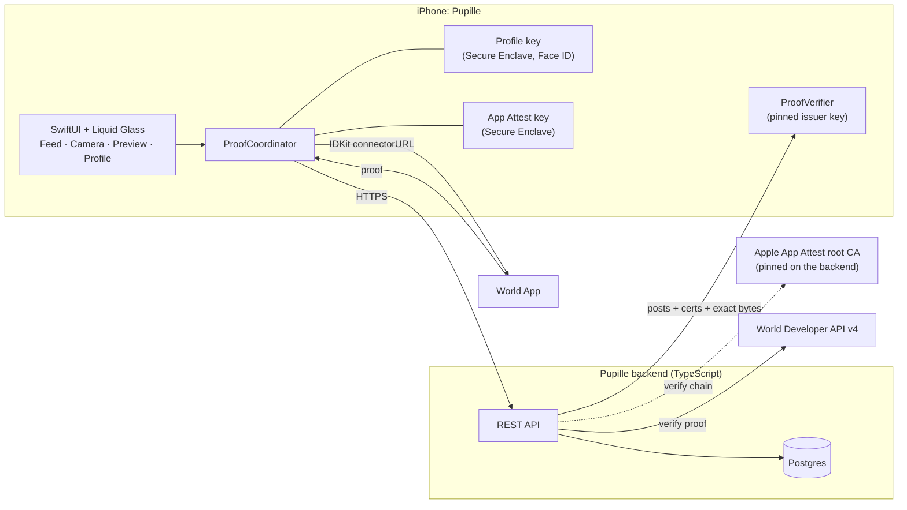
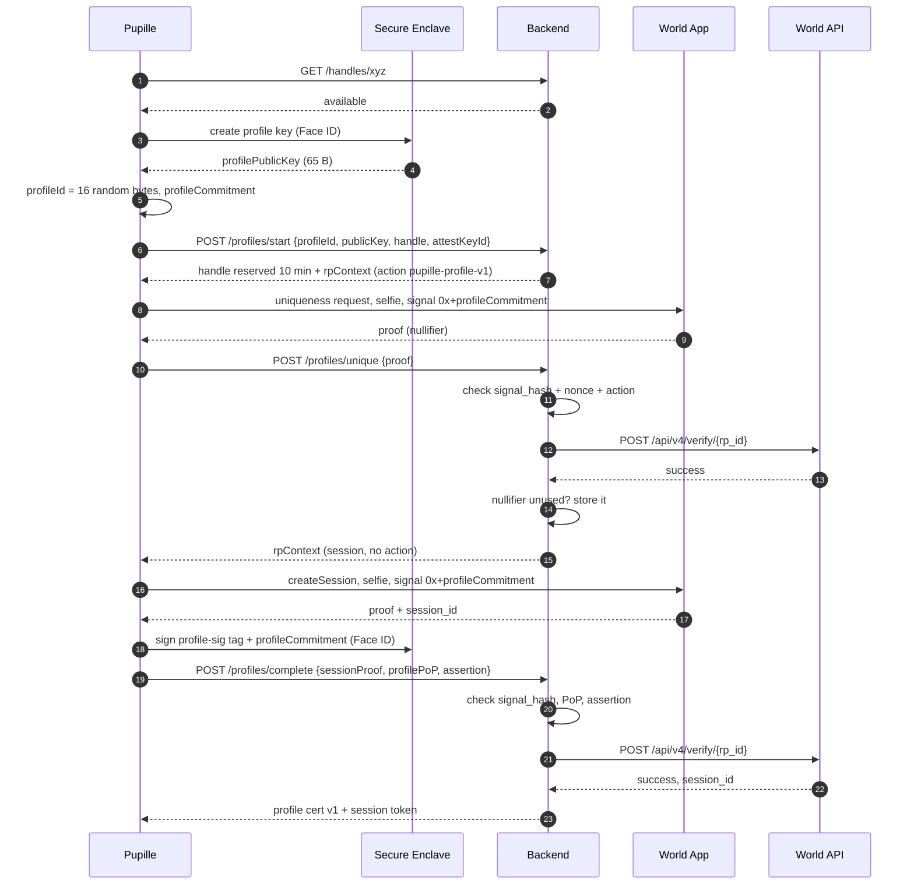
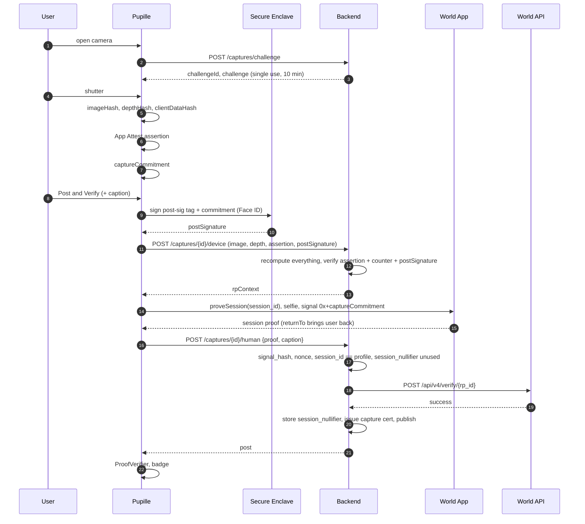
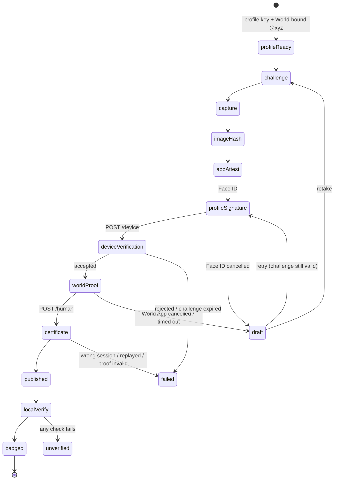

<!-- Pupille architecture. Source of truth for the build. Kept in sync with the design page. -->

ETHGlobal Tokyo 2026 · World · Best Use of IDKit

# Pupille: verify who published a photo, and how it was captured

A black-and-white photo feed for iOS. Anyone can check that a photo passed Pupille's trusted capture flow, and that it was published by the original World-backed pseudonymous author shown on the post.

Captured through Pupille · Genuine app/device attestation · Published by verified human @xyz · Image bytes unchanged

<a id="case"></a>

## 00 · The case for the prize

World's brief asks for IDKit at a genuine trust moment, with the minimum credential that covers it. Pupille uses IDKit at the two moments where trust is created: **claiming a pseudonym** and **publishing a photo**.

> **Pitch in one line:** "Pupille is a photo feed where anyone can cryptographically verify that a photo passed Pupille's trusted capture flow, and that it was published by the original World-backed pseudonymous author shown on the post."

### Where we're strongest against the brief

| World asks for | Where most teams stop | What Pupille does |
|----|----|----|
| **A genuine trust moment** | A "verify you're human" gate at sign-up | Two moments, each with the World ID flow built for it. **Creating @xyz**: a uniqueness proof (one profile per World ID) plus a new World ID session, both bound to that exact pseudonym and public key. **Publishing**: a session proof binds the same human to that exact photo. |
| **The minimum credential that covers it** | Orb-only, or as many credentials as possible | **Selfie Check.** The claim is "a real, unique person stands behind @xyz," nothing more. The full justification is in [§16](#prize). |
| **Server verification** | A proof checked only in the app | Every proof is verified by the backend through World's API, **against a signal the server computed itself**. |
| **Success plus an alternative scenario** | One contrived error screen | Cancel in the World App → the post stays a draft and never publishes. Also covered: a second profile for the same human is refused, a handle is taken, a proof from a different human doesn't match the profile, and a tampered or re-attributed photo loses its badge on every phone. |
| **Integration feedback** | A paragraph written at 8 AM | A friction log kept with timestamps from hour one ([§17](#feedback)). |

### What makes the use of IDKit distinctive

- **The signal binds a human to a key.** At profile creation the signal commits to `profileId`, the Secure Enclave public key and the handle. World ID doesn't just say "a human verified." It says "a human stands behind this exact key and name."
- **Authorship doesn't depend on our server.** Every photo is signed by the author's own Secure Enclave key. Any iPhone checks that signature itself. The server can't forge it.
- **It uses World ID 4.0 as designed.** The nullifier is used once, for uniqueness when the profile is created. `session_id` provides continuity on every post. This is exactly the split World's 4.0 migration guide prescribes, and the flow its Selfie Check docs recommend for repeated checks.
- **Signals are raw bytes.** Each commitment is passed as a `0x` hex signal, which IDKit hashes as bytes. The backend recomputes the `signal_hash` and checks it before calling World's verify API.
- **Layered trust, as in ZCAM:** media binding (hashes), device (App Attest), author (profile key), human (World ID). They're chained in one commitment, so no layer can be swapped out.

### Against ETHGlobal's judging criteria

| Criterion | Our answer |
|----|----|
| Technicality | Secure Enclave profile keys, App Attest checked on the server, World proofs bound to commitments, a byte-exact protocol with test vectors, a certificate chain verified on every phone |
| Originality | Signed-camera projects prove the device. Pupille also proves the author: a pseudonymous, World-backed identity that owns a hardware key. |
| Practicality | A real problem (AI images and impersonation in feeds), a familiar interface, one Face ID and one World App approval per post |
| User experience | Native SwiftUI with Liquid Glass. All the cryptography is compressed into one glyph and one sheet. |
| WOW factor | Live on two phones: flip one byte and the badge breaks. Relabel a post as another author and it breaks. Copy a certificate onto another photo and it breaks. |

### Say the limits before a judge does

App Attest doesn't prove where the photons came from. The backend vouches for the profile binding and the App Attest checks. Selfie Check is medium assurance. Each has a stated answer on this page ([§15](#threats), [§20](#future)).

<a id="badge"></a>

## 01 · What the badge proves

These are the four lines in the VerificationSheet, plus one optional line. For each: what backs it, and who has to be trusted.

| Sheet line | Mechanism | Trust | Tier |
|----|----|----|----|
| **Captured through Pupille** | Single-use server challenge before the shutter. Camera-only path with no Photo Library import. | Pupille issuer | `must` |
| **Genuine app/device attestation** | App Attest key attested by Apple. Per-capture assertion over the image hash and challenge. | Pupille issuer (checked Apple) | `must` |
| **Published by verified human @xyz** | Profile key signature over the capture commitment. The profile certificate binds the key to @xyz and to a World uniqueness proof. The per-post World session proof carries the profile's `session_id`. | **Signature checked on the phone.** Profile binding vouched for by the issuer. | `must` |
| **Image bytes unchanged** | `SHA-256(imageBytes)` equals the committed hash | **Checked on the phone, no trust needed** | `must` |
| 3D scene | LiDAR depth hashed into the assertion and the commitment. Flatness recomputed by the backend. | Pupille issuer | `should` |

> **Precise wording, in the style of ZCAM:** App Attest shows that an attested Pupille app instance authenticated this payload. It doesn't prove the photons came straight from an untouched sensor, or that what's shown is true. World ID shows that a unique verified human stands behind @xyz. It doesn't reveal who that human is.

<a id="refine"></a>

## 02 · Refinements to the prompt

The design follows the updated prompt. Where it adds precision, the change and the reason are listed here.

| Prompt says | This design | Why |
|----|----|----|
| "Performs the verification flow in the background" | Everything runs in the background except two visible steps: Face ID (profile signature) and approving in the World App | A World proof requires switching to the World App. Designing that handoff deliberately looks better than hiding it. |
| Assertion over `SHA256("pupille:v1" || imageHash || challenge)` | Tag `pupille:assert:v1`, plus `depthHash` (zeros when absent) | One tag per purpose. Adding LiDAR later then doesn't change the protocol. |
| `captureCommitment` as listed | Same fields in the same order, plus `depthHash` after `imageHash` | Same as above |
| "Sign that commitment" | Sign `"pupille:post-sig:v1" || captureCommitment` | The same key will sign profile changes and future objects. The tag stops a post signature from being reused as any other kind of signature. |
| "World session/continuity proof where supported" | **Supported, and used.** `createSession` when the profile is created, `proveSession(session_id)` for each post and each key rotation. | In World ID 4.0, a nullifier can only be used once per action. `session_id` is the documented way to link a returning user (§03). |
| (not in the prompt) | A uniqueness proof (action `pupille-profile-v1`) when the profile is created, in addition to the session | A session alone gives continuity but not "one profile per World ID." That needs a uniqueness nullifier. |
| (not in the prompt) | Signals are `"0x" + hex(commitment)` | IDKit decodes `0x` hex signals as raw bytes. Without the prefix, the 64 characters would be hashed as text, which is ambiguous. |
| "The public key becomes the permanent identity" | `profileId` is permanent. Keys are versioned. A new iPhone rotates the key with a World proof from the same human. | Secure Enclave keys can't leave the device. Without rotation, a lost phone means a lost profile. |
| Signal includes the handle | The handle is chosen and **reserved** for 10 min before the World proof | The handle has to exist before the signal can commit to it. |

<a id="worldfacts"></a>

## 03 · World ID facts this design relies on

Checked on 26 Sept 2026 against docs.world.org and the IDKit source (`worldcoin/idkit` main, `worldcoin/idkit-swift` 4.0.11). Each row is either quoted from the docs or read in the code.

| Fact | Consequence for Pupille | Source |
|----|----|----|
| **In 4.0, nullifiers are one-time-use per action.** A uniqueness request lets each user complete an action once. Repeats fail with `nullifier_replayed` or `max_verifications_reached`. | A per-post proof can't reuse the same action. The earlier "one action, same nullifier" design wouldn't work. | [4.0 migration](https://docs.world.org/world-id/4-0-migration), [error codes](https://docs.world.org/world-id/idkit/error-codes) |
| **`session_id` is the stable link across requests.** Create a session once, save it to the account, then prove that same session on later checks. `session_nullifier` (`[nullifier, action]`) is per-proof replay protection, not an account ID. | Profile creation → `createSession`. Every post → `proveSession(savedSessionId)`. Store and reject reused session nullifiers. | [Session proofs](https://docs.world.org/world-id/idkit/session-proofs) |
| Session proofs are World's recommended flow for repeated Selfie Check verification | Our per-post check is the documented use case, not a workaround | [Selfie Check](https://docs.world.org/world-id/credentials/11) |
| Session requests carry presets (and signals). Their RP signature is made **without an action** (49-byte message). | The backend calls `signRequest({signingKeyHex})` with no action for sessions, and with an action for the uniqueness proof | [RP signatures](https://docs.world.org/world-id/idkit/signatures), `rust/core/src/bridge.rs` |
| **Signal encoding:** a string that is `0x` + even-length hex is decoded to raw bytes. Anything else is hashed as UTF-8 text. `signal_hash = keccak256(bytes) >> 8`. | Signals are `"0x" + hex(commitment)`. Signal-hash test vectors are in §06. | `rust/core/src/types.rs`, RP signatures page |
| **The verify API does not take an expected signal.** It checks the proof against the `signal_hash` inside the result. IDKit computes it, and the RP must not reshape the payload. | The backend must compare each response's `signal_hash` with `hashSignal(expected)` *itself*, then forward the unchanged result to `/api/v4/verify/{rp_id}`. | [Verify API](https://docs.world.org/api-reference/developer-portal/verify) |
| Selfie Check results include `sybil_score` and an `integrity_bundle` (World App's App Attest attestation), which must be forwarded | Forward them unchanged. Store `sybil_score` and act on it only after verification succeeds. | Verify API, Selfie Check |
| **Selfie Check is medium assurance.** It "does not provide a strict one-person-one-account guarantee." It has a 90-day inactivity window. | Claim "one profile per World ID," with Orb as the strong label. Don't claim strict uniqueness for Selfie. | Selfie Check |
| IDKit supports `return_to` (a deep-link callback URL) | `returnTo: "pupille://world-done"` brings the user straight back after they approve | JS and Swift references |
| **Swift SDK 4.0.11 (latest release):** the public wrapper has no 4.0 `selfieCheck` preset, and `createSession`/`proveSession` are commented out ("Re-enable when World ID 4.0 is live"). The generated bindings underneath are public: `IdKitBuilder.fromCreateSession`, `fromProveSession`, `.constraints(...)` with `CredentialType.selfie`. | `WorldIDService` uses the generated bindings directly (§11). Fallback: the backend runs `@worldcoin/idkit-core` 4.3.0, which has full session and Selfie Check support, and hands the connector URL to the app. | `idkit-swift/Sources/IDKit` |
| Testing: `staging` + simulator.worldcoin.org, or `sandbox` (TestFlight World ID app, access by request) | Confirm at the booth which environment supports 4.0 sessions and Selfie Check today | [Sandbox](https://docs.world.org/world-id/sandbox/what-is-sandbox) |

<a id="overview"></a>

## 04 · System overview



### Chain of trust for one post

`image bytes → captureCommitment → App Attest assertion → profile key signature → profile cert: key ↔ @xyz → World session proof (profile's session_id)`

The commitment includes the image hash, depth, challenge, assertion hash, `profileId` and the profile public key. So each later link covers everything before it.

<a id="identity"></a>

## 05 · Profiles as keys

A profile is a cryptographic identity, not a username row. The public handle is private about the person behind it.

- **profileId**: 16 random bytes, generated on the phone at creation. Permanent: it survives key rotation.
- **Profile key**: Secure Enclave P-256, non-exportable, Face ID to sign. It signs posts, auth challenges and future profile changes. It's versioned.
- **@handle**: Claimed once, immutable for the MVP. `^[a-z0-9_]{3,20}$`, case-insensitive unique. It's inside the World signal, so it's bound to the human.
- **Profile certificate**: Issuer-signed: profileId, handle, key, key version, credential, proof digest. There's one per key version, and it travels with every post.

### How World ID attaches to a profile

| World primitive | When | Signal | Stored | Gives us |
|----|----|----|----|----|
| Uniqueness proof, action `pupille-profile-v1` | Once, when the profile is created | `0x` + profileCommitment | Nullifier (`NUMERIC(78,0)`, unique) | One profile per World ID |
| `createSession` | Once, when the profile is created | `0x` + profileCommitment | `session_id` on the profile | The anchor for continuity |
| `proveSession(session_id)` | Every post | `0x` + captureCommitment | `session_nullifier` (replay table) | The same World ID that created @xyz approved this exact photo |
| `proveSession(session_id)` + `require_user_presence` | Key rotation (new iPhone) | `0x` + new profileCommitment | New key version | Moving the profile to a new device |

### Rules

- **One profile per World ID.** A second uniqueness proof from the same World ID returns an already-used nullifier, and the backend refuses it with "You already are @abc." With Selfie Check this is medium assurance (World's own wording). Orb makes it strict.
- **Continuity comes from `session_id`, never the nullifier.** Replacing a profile's session is a security operation, as World's session guide says. It's only allowed through a proof of the existing session.
- **New iPhone = key rotation.** A proof of the saved session over a new profileCommitment (same profileId and handle, new key) activates key version `n+1` and retires `n`. Old posts stay valid.
- **A passkey is optional and separate:** for login or recovery later, never as the authorship key.

<a id="spec"></a>

## 06 · Protocol byte spec

Swift and TypeScript must build byte-identical inputs. Both must pass the test vectors before anything is built on top.

### Conventions

- `H` = SHA-256. Hashes are **raw 32 bytes** as inputs. Use hex only in JSON and in IDKit signals (lowercase).
- `||` = concatenation. Tags are ASCII with no terminator. Every field is fixed-length except `handle`, which always comes last.
- `challenge` = 32 random bytes. `profileId` = 16 bytes. `profilePublicKey` = 65-byte X9.63 (`0x04 || X || Y`, CryptoKit `x963Representation`). `handle` = lowercase UTF-8, without "@".
- Profile signatures are ECDSA P-256 with SHA-256, **raw r‖s 64 bytes** (`P256.Signing.ECDSASignature.rawRepresentation`). Node verifies with `crypto.verify("sha256", message, {key, dsaEncoding: "ieee-p1363"}, sig)`. Both sides hash the message themselves, so pass the tagged message and never a pre-computed digest.
- Public key conversion in Node: X9.63 → JWK `{kty:"EC", crv:"P-256", x: b64url(bytes 1–32), y: b64url(bytes 33–64)}` → `crypto.createPublicKey({key: jwk, format: "jwk"})`.

### Derivations

```text
// profile creation / key rotation
profileCommitment = H("pupille:profile:v1" || profileId || profilePublicKey || handle)
profileSignal     = "0x" + hex(profileCommitment)                           // IDKit signal (decoded as 32 raw bytes)
profilePoP        = Sign(profileKey, "pupille:profile-sig:v1" || profileCommitment)   // proves key possession

// per capture
imageHash         = H(imageBytes)
depthHash         = H(depthBytes)  or  32 zero bytes
clientDataHash    = H("pupille:assert:v1" || imageHash || depthHash || challenge)
assertion         = DCAppAttestService.generateAssertion(keyId, clientDataHash)
assertionHash     = H(assertion)
captureCommitment = H("pupille:capture:v1" || imageHash || depthHash || challenge
                      || assertionHash || profileId || profilePublicKey)
postSignature     = Sign(profileKey, "pupille:post-sig:v1" || captureCommitment)
worldSignal       = "0x" + hex(captureCommitment)                           // IDKit signal (raw bytes)

// World side (IDKit computes this; the backend must recompute and compare)
signal_hash       = "0x" + hex( uint256(keccak256(signalBytes)) >> 8 )      // = IDKit.hashSignal(signal)

// auth
authSignature     = Sign(profileKey, "pupille:auth:v1" || authChallenge)
worldProofHash    = H(exact bytes of the IDKit result JSON sent by the app)
```

Hashing is SHA-256 on our side and Keccak-256 on World's (`hash_to_field`). Use `IDKit.hashSignal` (Swift) or `hashSignal` from `@worldcoin/idkit-core/hashing` (Node) instead of writing your own. The `signal_hash` vectors below were checked against World's published `hash_to_field` vectors.

### Test vectors

Inputs: `imageBytes` = ASCII `pupille-test-image`, `depthBytes` = ASCII `pupille-test-depth`, `challenge` = `00 01 … 1f`, `assertion` = ASCII `pupille-test-assertion`, `profileId` = `40 41 … 4f`, `profilePublicKey` = `04` followed by 64 × `11`, `handle` = `xyz`.

| Value | Expected (hex) |
|----|----|
| `profileCommitment` | `cb3dfa39b9aa0a69953457ddeccccce2d5e525616cceaa1371f525976bc3afcb` |
| `imageHash` | `4e7044f1193044743df1880194fab538d607d219408c1092ff77eb45a2eaf665` |
| `depthHash` | `5415cfd0583130a6191c532073f346d78d58a0ee528a04d0f231838e3224e241` |
| `clientDataHash` | `653cc83bc26205563b5635f4e5b644186cdf50c4a49893af86b1219615c2bb27` |
| `assertionHash` | `8f7fe9bf38c364dfbcf08aef9005b5d7b76d6f491f02c8831bb082d681f15bde` |
| `captureCommitment` | `9e4351a4e2c238fb74d470a06201f16f7798670d8a9404e03aec14bf7e5f3b81` |
| `clientDataHash` (no depth) | `3ef26e74876b28c66a4fd26c3eed63ce6256beaed8d9ee1edf4ea1bd0718a13c` |
| `captureCommitment` (no depth) | `cd4318a78cb7b8a68841b97407f51164b3db7ad06864f94acdf258a7d9bd35a8` |
| `signal_hash` of `profileSignal` | `0x004f635db677ba0a89f2b6fda2cb0e24ce391aefa22dc757f438aa73946d0cbe` |
| `signal_hash` of `worldSignal` | `0x006641a703b91c4d6ba5165df85946f44a05d182a9fdaf15c78981858362f9c8` |
| `signal_hash` of `worldSignal` (no depth) | `0x0053d9d11c6f8f38ae17fd5a7e2696f1cbe69b57b74559454e3afbd992b1ebc3` |

ECDSA signatures are randomized, so they have no fixed vector. Test them with a round trip instead: Swift signs, Node verifies, and Node rejects the same signature over a modified commitment.

<a id="profileflow"></a>

## 07 · Flow: create @handle

First launch attests the App Attest key once (challenge → `attestKey` → `/attest/register`). Creating a profile then takes two short World App approvals: "Prove you're unique" and "Link World ID to @xyz". With `returnTo`, each one brings the user straight back.



**Backend checks, in order:** reservation valid → each response's `signal_hash == hashSignal("0x"+profileCommitment)` → nonce matches the one issued → World verify succeeds → the nullifier hasn't been used (otherwise return `409 one_profile_per_human` with that profile's handle) → `profilePoP` is valid under the submitted key → App Attest assertion over `H("pupille:profile-assert:v1" || profileCommitment)` → store `session_id` and `sybil_score`.

**Key rotation (new iPhone):** the user enters their handle and a new key is created. `proveSession(saved session_id)` runs with `require_user_presence` and the new profileCommitment as the signal. The backend checks that `session_id` matches the profile, then issues key version `n+1`. No new uniqueness proof is needed.

**Failure screens, mapped to IDKit codes:** `user_rejected` / `cancelled` → "You cancelled in World ID. @xyz isn't created yet." · `credential_unavailable` → "Complete Selfie Check in World ID first." · `user_presence_failed` · `timeout` · `rp_signature_expired` → retry with a fresh context · `409 one_profile_per_human` → "You already are @abc" · `handleTaken` · `reservationExpired` · `attestUnsupported`.

<a id="post"></a>

## 08 · Flow: Post & Verify

The protected action is **publishing**. If any step fails, nothing reaches the feed.



### State machine (`ProofCoordinator`)



- **Cancelling in the World App is the demo's alternative scenario.** The post stays a local draft: "Not posted — approve in World App to publish."
- The backend recomputes `imageHash`, `depthHash`, `clientDataHash` and `captureCommitment` from its own stored challenge and the active profile key. It never accepts a hash from the client.
- Assertion check: signature over `H(authenticatorData || clientDataHash)` under the stored key, `rpIdHash == H(appId)`, counter greater than the stored counter.
- World checks on `/human`, in order: response `signal_hash == hashSignal("0x"+captureCommitment)` → `nonce` is the one issued with this challenge's RP context → `session_id == profile.session_id` → `session_nullifier` not seen before → forward the unchanged result (including `integrity_bundle`) to `/api/v4/verify/{rp_id}` → store the session nullifier.
- The RP context for the session proof is signed **without an action**. Every request gets a fresh nonce, since World rejects `duplicate_nonce`.
- To post you need a session token, the device's App Attest key, the profile key (Face ID) and a session proof from the World ID that created the profile. A stolen token alone can't post anything.

<a id="feed"></a>

## 09 · Flow: feed verification

`ProofVerifier` is a pure function that runs on every post before `PostView` draws the glyph. It never trusts a `verified` field from the server.

| \# | Check | Catches |
|----|----|----|
| 1 | Profile cert: Ed25519 signature under the pinned issuer key, `v`, `uniquenessAction`, `worldSession: true` | Forged profile |
| 2 | `profileCert.publicKey == post.authorPublicKey`, `profileCert.handle == post.handle`, `profileId` matches | **Swapped author** |
| 3 | Capture cert: signature under the pinned key, `v`, `appId`, `profileId` and `keyVersion` match the profile cert | Forged or mismatched cert |
| 4 | `H(downloaded bytes) == captureCert.imageSha256`, and the same for depth | **Edited image, certificate copied onto another image** |
| 5 | Recompute `captureCommitment` from the cert fields and the profile key. It must equal `captureCert.captureCommitment`. | Inconsistent cert |
| 6 | `postSignature` verifies under `profilePublicKey` over `"pupille:post-sig:v1" || captureCommitment` | **Authorship forged by anyone, including the server** |
| 7 | Optional: `H(caption) == captureCert.captionSha256` | Edited caption |

`PostView` states: `verifying` (no glyph), `verified` (glyph, tap opens the sheet), `unverified(reason)` (explicit crossed-out glyph). The three demo attacks are one byte flipped, author relabelled, and a certificate copied onto another image. They fail checks 4, 2/6 and 4 respectively.

> **Serve exact bytes.** No CDN resizing, recompression or metadata stripping. Make thumbnails on the phone.

<a id="certs"></a>

## 10 · Certificates and post payload

Both certificates are JSON signed once by the issuer's Ed25519 key, then kept and sent as exact bytes (`certB64` + `sigB64`). They're never re-serialized.

- ```text
// Profile certificate (one per key version)
{
  "v": 1,
  "type": "profile",
  "issuer": "pupille-backend-1",
  "profileId": "404142…4f",
  "handle": "xyz",
  "keyVersion": 1,
  "publicKey": "BBER…",            // base64 X9.63
  "credential": "selfie",
  "uniquenessAction": "pupille-profile-v1",
  "worldSession": true,
  "profileCommitment": "cb3dfa39…",
  "worldProofSha256": "…",
  "appAttestKeyId": "…",
  "validFrom": "2026-09-26T09:02:11Z"
}
```

  ```text
// Capture certificate (one per post)
{
  "v": 1,
  "type": "capture",
  "issuer": "pupille-backend-1",
  "postId": "01J8Z…",
  "appId": "ABCDE12345.app.pupille",
  "profileId": "404142…4f",
  "keyVersion": 1,
  "imageSha256": "4e7044f1…",
  "depthSha256": "5415cfd0…",
  "flatness": 0.0831,
  "captionSha256": null,
  "challenge": "000102…1f",
  "assertionSha256": "8f7fe9bf…",
  "captureCommitment": "9e4351a4…",
  "worldProofSha256": "…",
  "challengeIssuedAt": "…",
  "certifiedAt": "…"
}
```

```text
// Post as returned by GET /v1/feed
{ "id": "01J8Z…", "imageUrl": "/v1/posts/01J8Z…/image", "caption": null,
  "author": { "handle": "xyz", "profileId": "…", "publicKey": "BBER…" },
  "postSignature": "base64 r‖s",
  "profileCert":  { "certB64": "…", "sigB64": "…" },
  "captureCert":  { "certB64": "…", "sigB64": "…" },
  "depthUrl": null, "createdAt": "…" }
```

Neither the nullifier nor the `session_id` appears in any certificate. They stay on the server. The certificates only say which World proofs were verified, and give their digests. `credential` comes from the verified response's `identifier` / `issuer_schema_id` (`11` = Selfie Check, `1` = Proof of Human).

<a id="ios"></a>

## 11 · iOS app

SwiftUI with Liquid Glass (iOS 26 SDK): edge-to-edge photos, monochrome type, glass tab bar and sheets. The only color is the glyph's state.

### Views

| View | Contents |
|----|----|
| `CreateProfileView` | Pick @handle (live availability) → "Prove you're unique" (World App) → "Link World ID to @xyz" (World App) → Face ID → done. Failure and "you already are @abc" screens. Also the "Move @xyz to this iPhone" rotation entry. |
| `FeedView` | Global vertical feed, newest first, pull to refresh |
| `CameraView` | Full-screen `AVCaptureSession`. The challenge is fetched on appear. No library button. |
| `CapturePreviewView` | Minimal preview, caption field, **Post & Verify**, retake |
| `PostView` | Full-width image, @xyz, timestamp, optional caption, glyph in the bottom-right corner |
| `VerificationSheet` | Glass sheet with the four guarantees, each checked. Expandable details: key fingerprint, hashes, times, credential. |
| `ProfileView` | @xyz, key fingerprint, credential, grid of your own posts, unposted drafts |

### Services

| Service | Job | APIs |
|----|----|----|
| `CameraService` | Session and capture. Returns encoded bytes (and depth if available). | `AVCapturePhotoOutput` |
| `CaptureHasher` | Every derivation in §06. The test vectors live here. | CryptoKit `SHA256` |
| `AppAttestService` | Creates and attests the key on first launch. Makes assertions. | `DCAppAttestService` |
| `ProfileKeyService` | Creates and loads the profile key and signs tagged messages. Exposes the public key and fingerprint. | `SecureEnclave.P256.Signing.PrivateKey`, `SecAccessControl(.privateKeyUsage, .biometryCurrentSet)` |
| `WorldIDService` | Three calls: `proveUnique(signal:)`, `createSession(signal:)`, `proveSession(id:signal:)`. Opens the World App with `returnTo`, polls, maps IDKit error codes to typed outcomes. | IDKit Swift 4.0.11 generated bindings |
| `ProofCoordinator` | Owns the profile-creation and Post & Verify state machines | `@Observable`, Swift concurrency |
| `ProofVerifier` | Checks 1–7 from §09. Pure and unit-tested. | CryptoKit `P256`, `Curve25519` |
| `FeedService` | Fetches posts and exact bytes, runs the verifier, publishes `[Post]` | `URLSession` |
| `ProfileStore` | Current profile, key version, own posts, drafts | SwiftData, Keychain |
| `APIClient` | Typed endpoints, session token | `URLSession` |

### `WorldIDService` on IDKit Swift 4.0.11

The public wrapper doesn't expose sessions or the 4.0 Selfie preset yet, so call the generated (public) bindings. Sketch:

```text
import IDKit

func selfie(_ signal: String) -> ConstraintNode {        // signal = "0x" + hex(commitment)
  .item(request: .withStringSignal(credentialType: .selfie, signal: signal))
}

// Session proof for a post (createSession is identical via IdKitBuilder.fromCreateSession)
let cfg = IdKitSessionConfig(appId: appId, packageName: "app.pupille", packageVersion: "1.0",
                             rpContext: rpContext, actionDescription: nil, bridgeUrl: nil,
                             requireUserPresence: false, overrideConnectBaseUrl: nil,
                             returnTo: "pupille://world-done", environment: .production)
let req = try IdKitBuilder.fromProveSession(sessionId: savedSessionId, config: cfg)
                          .constraints(constraints: selfie(worldSignal))
await UIApplication.shared.open(URL(string: req.connectUrl())!)
// poll req.pollStatusOnce() → .confirmed(result:) | .failed(error:) → send result JSON to backend unchanged
```

Check the exact initializer labels against the generated file when you build, since this is generated code. Uniqueness proofs go through `IdKitBuilder.fromRequest(config: IdKitRequestConfig(action: "pupille-profile-v1", allowLegacyProofs: false, …))`.

### Model

```text
struct Post: Identifiable {
  let id: String
  let imageData: Data                 // exact bytes as downloaded
  let caption: String?
  let authorHandle: String
  let authorPublicKey: Data           // 65-byte X9.63
  let postSignature: Data             // 64-byte r‖s
  let profileCertificate: SignedBlob  // exact bytes + Ed25519 sig
  let captureCertificate: SignedBlob
  var verification: VerificationState // .verifying | .verified | .unverified(Reason)
}
```

Setup: `NSCameraUsageDescription`, `NSFaceIDUsageDescription`, the App Attest entitlement (`development`, which changes the expected AAGUID), and the Keychain. Run on a physical iPhone with iOS 26, since the Secure Enclave and App Attest don't run in the Simulator.

<a id="backend"></a>

## 12 · Backend

TypeScript (Hono) + Postgres on Railway or Fly. Images are stored as `bytea`, which is fine at demo scale.

### API

| Endpoint | Auth | Does |
|----|----|----|
| `POST /v1/attest/challenge`, `/v1/attest/register` | none | Attests the App Attest key: Apple chain, nonce, appId, AAGUID. Stores the key with counter 0. |
| `GET /v1/handles/:h` | none | Checks availability |
| `POST /v1/profiles/start` | attested key | Reserves the handle for 10 min and stores profileId and key. Returns `rpContext` signed **with** action `pupille-profile-v1`. |
| `POST /v1/profiles/unique` | reservation | Uniqueness proof: signal_hash, nonce, verify, nullifier unused (else 409 with the existing handle). Returns an `rpContext` signed **without** an action for the session. |
| `POST /v1/profiles/complete` | attested key + PoP | createSession proof: signal_hash, verify, store `session_id` and `sybil_score`. PoP and assertion. Returns the profile cert and a session token. |
| `POST /v1/profiles/rotate` | new key PoP | proveSession proof over the new profileCommitment. `session_id` must match the profile. Returns cert v(n+1). |
| `POST /v1/auth/challenge` → `/v1/auth/token` | profile key | Session token from a signed challenge |
| `POST /v1/captures/challenge` | session | Single-use challenge (10 min), bound to the profile, key version and App Attest key |
| `POST /v1/captures/:id/device` | session | Multipart image, depth, assertion and post signature. Recomputes everything and checks the assertion, counter and signature. Returns `rpContext`. |
| `POST /v1/captures/:id/human` | session | Session proof: signal_hash, nonce, `session_id` matches the profile, `session_nullifier` unused, World verify. Issues the capture cert and publishes. |
| `GET /v1/feed` | none | Post payloads (§10) |
| `GET /v1/posts/:id/image` | none | Exact bytes |
| `GET /v1/profiles/:handle` | none | Profile certs for every key version, and the posts |

### Schema

```text
create extension if not exists citext;

create table profiles (
  id          bytea primary key,                 -- 16-byte profileId
  nullifier   numeric(78,0) unique not null,     -- uniqueness proof (pupille-profile-v1); never leaves the server
  session_id  text unique not null,              -- World session_<128 hex>; continuity anchor
  sybil_score int,                               -- Selfie Check risk signal (stored, not shown)
  handle      citext unique not null check (handle ~ '^[a-z0-9_]{3,20}$'),
  credential  text not null,
  created_at  timestamptz not null default now()
);

create table profile_keys (
  profile_id   bytea not null references profiles(id),
  key_version  int not null,
  public_key   bytea unique not null,           -- 65-byte X9.63
  status       text not null default 'active',  -- active | retired
  cert         bytea not null, cert_sig bytea not null,
  activated_at timestamptz not null default now(), retired_at timestamptz,
  primary key (profile_id, key_version)
);
create unique index one_active_key on profile_keys(profile_id) where status = 'active';

create table profile_sessions (                 -- handle reservation + pending proof
  id text primary key, profile_id bytea not null, public_key bytea not null,
  handle citext not null, app_attest_key_id text not null,
  expires_at timestamptz not null, used boolean not null default false
);

create table world_session_nullifiers (         -- per-proof replay protection
  nullifier numeric(78,0) not null, action text not null,
  used_at timestamptz not null default now(), primary key (nullifier, action)
);

create table app_attest_keys (
  key_id text primary key, public_key bytea not null, receipt bytea,
  counter bigint not null default 0, created_at timestamptz not null default now()
);

create table capture_challenges (
  id text primary key, challenge bytea not null,
  profile_id bytea not null, key_version int not null, app_attest_key_id text not null,
  image_sha256 bytea, depth_sha256 bytea, assertion_sha256 bytea,
  commitment bytea, post_signature bytea, world_proof jsonb,
  status text not null default 'issued',          -- issued | device_ok | used | expired
  issued_at timestamptz not null default now(), expires_at timestamptz not null
);

create table posts (
  id text primary key,
  profile_id bytea not null, key_version int not null,
  challenge_id text unique not null references capture_challenges(id),
  image bytea not null, content_type text not null, depth bytea, caption text,
  post_signature bytea not null, capture_cert bytea not null, capture_cert_sig bytea not null,
  created_at timestamptz not null default now(),
  foreign key (profile_id, key_version) references profile_keys(profile_id, key_version)
);
```

> **Two easy hours to lose:** App Attest CBOR parsing (use an existing Node library and test against a real device early), and ECDSA encoding (CryptoKit's raw r‖s needs `ieee-p1363` in Node, and the X9.63 public key has to be converted to a JWK or SPKI key object).

<a id="secrets"></a>

## 13 · Keys and secrets

| Key | Lives in | Signs |
|----|----|----|
| Profile key (P-256), versioned | Secure Enclave, non-exportable, Face ID. Public key in the profile cert. | Posts, profile PoP, auth challenges |
| App Attest key (P-256) | Secure Enclave, per install. Public key stored by the backend. | Assertions |
| Issuer key (Ed25519) | Backend environment. Public key pinned in the app. | Profile and capture certificates |
| RP signing key | Backend environment | IDKit `rpContext` |
| Session secret | Backend environment | Session tokens |

<a id="privacy"></a>

## 14 · Privacy model

| Party | Knows | Doesn't know |
|----|----|----|
| Anyone in the feed | @xyz, profile public key, credential level, photos, time windows | Real name, face, nullifier, session ID |
| Pupille backend | Nullifier ↔ profile ↔ keys ↔ posts | Real name, face, biometrics |
| World | That proofs were made for Pupille's action | Handle, key, photos. It only sees opaque 64-character signals. |
| Other World ID apps | Nothing. Nullifiers are scoped per app and action. | Everything |

<a id="threats"></a>

## 15 · Threat model

| Attack | Mitigation | What's left |
|----|----|----|
| Edit the image | Hash check on every phone | None |
| Copy a certificate onto another image | The image hash is in the certificate and the signed commitment | None |
| Relabel a post as another author | Profile key signature over a commitment that contains that key. Profile cert binds the key to the handle. | None |
| The server forges a post as @xyz | It can't produce `postSignature` without the Secure Enclave key | A malicious server could issue a false *profile cert* for a new key. Later: a public key-transparency log. |
| Post an AI image through the app | Camera-only path. App Attest proves an unmodified app. | A compromised device injecting frames |
| Photograph a screen | LiDAR flatness (should-have) | Stated openly |
| Farm profiles or take over a handle | One profile per uniqueness nullifier. Rotation and posting require a proof of the profile's `session_id`. | Selfie Check is medium assurance and not strictly one account per person (World's wording). `sybil_score` is stored. The sheet shows the credential. |
| Replay a World proof, challenge or assertion | Signal = commitment (checked through `signal_hash`). Fresh RP nonce per request. `session_nullifier` replay table. Single-use challenge. Increasing App Attest counter. | None |
| Stolen phone | Face ID on the profile key. The owner rotates the key from a new phone, which retires the old one. | Posts signed before the rotation stay valid |
| Another person enrolled in the phone's Face ID | None at the protocol level | Stated limitation. The per-post World proof reduces it: the World App also has to approve. |

<a id="prize"></a>

## 16 · Prize checklist: Best Use of IDKit

| Requirement | How we meet it | Evidence |
|----|----|----|
| IDKit in a working app | IDKit Swift in a native iOS app, with three World ID 4.0 flows: a uniqueness proof and `createSession` when @xyz is created, and `proveSession` at every post and key rotation | Live demo. `WorldIDService.swift` |
| A credential with server verification | Selfie Check (Orb accepted). Every proof verified via `/api/v4/verify` against a signal the server computed. | `/profiles/complete`, `/captures/:id/human` |
| Explain the trust moment and why the credential is the minimum | Claiming a pseudonym and publishing a photo. Selfie Check justified in the table below. | First 30 seconds of the video. README "Why Selfie Check". |
| Success plus an alternative scenario | Published with badge / cancelled → draft / second profile refused / different human refused | Demo steps 2, 3, 7 |
| Integration feedback | Log in §17 | README section |

### Why Selfie Check is the minimum that covers it

| Credential | Decision | Reason |
|----|----|----|
| Selfie Check | `required` | The threats are bots, AI farms, sockpuppets and impersonation. A live human behind each pseudonym, re-checked through sessions on every post, covers them. Sessions are World's documented flow for repeated Selfie Check verification. Anyone with World ID can get it, with no Orb or document needed. |
| Proof of Human (Orb) | `accepted, shown` | Stronger uniqueness. Shown in the sheet, but requiring it would lock out most users. |
| Passport | `not requested` | Adds nothing to "a human stands behind @xyz" |
| Identity Check | `not requested` | Reveals attributes such as age or nationality. That's over-collection that would break the pseudonymity promise. |
| `require_user_presence` | `profile creation + rotation` | A fresh liveness check where the identity is created or moved. Per post, approving in the World App is enough. |

<a id="feedback"></a>

## 17 · Integration feedback log

A required deliverable. Keep one shared `FEEDBACK.md` and write an entry as each thing happens.

```text
## Integration feedback: World IDKit (Swift 4.x)

Time to first success
- HH:MM  started: Developer Portal app + action created
- HH:MM  first staging proof verified by backend      → X h Y min

Friction log   (tag: [docs] [sdk] [portal] [world-app])
- HH:MM  [tag]  what happened, what we tried, what fixed it

Documentation gaps
Highest-impact improvement
```

<a id="plan"></a>

## 18 · Build plan

Deadline Sunday 09:00 JST. Do the riskiest parts first.

| Milestone | iOS | Backend | Tier |
|----|----|----|----|
| M0: De-risk | Generated-bindings `WorldIDService`: one uniqueness proof, `createSession`, then `proveSession` with the saved ID, each with a `0x` signal and `returnTo`. App Attest on a real phone. The Secure Enclave key signs. | `signRequest` with and without an action. `signal_hash` check against the vectors. Verify returns `session_id`. App Attest attestation verifies. Secure Enclave signature verifies in Node (P1363). | `must, first` |
| M1: Byte spec | `CaptureHasher` passes the vectors | Same in TypeScript | `must` |
| M2: Profiles | `ProfileKeyService`, `CreateProfileView`, failure screens | Attest, handles, profiles start/unique/complete, profile cert, auth | `must` |
| M3: Post & Verify | Camera, preview, `ProofCoordinator`, draft on cancel | Challenge, device, human, capture cert | `must` |
| M4: Feed | `FeedView`, `PostView`, `ProofVerifier`, `VerificationSheet`, `ProfileView` | Feed, image, profile endpoints. Deploy. | `must` |
| M5: Polish + attack demo | Liquid Glass pass, unverified glyph | Admin switches: flip byte, relabel author, copy cert | `should` |
| M6: Depth, rotation | LiDAR flatness. New-iPhone rotation UI. | Flatness, rotation path | `should` |
| Demo readiness | Switch to production IDKit. Both of you complete Selfie Check in the real World App. Dry run on the venue Wi-Fi. | (both) | `must` |
| Submit | 2–4 min video (Mac screen capture with the iPhone mirrored), README with AI-usage disclosure and the feedback log, submit with at least 1 hour to spare | (both) | `must` |

**Demo script (4 min):** (1) create @xyz (two World App approvals) → (2) take a photo, Post & Verify, cancel in World App → draft → (3) retry: Face ID, approve → the post appears with the glyph → (4) VerificationSheet → (5) second phone shows it verified → (6) three attacks: flip a byte, relabel it as @abc, copy the certificate onto another photo → each turns Unverified → (7) try to create a second profile with the same World ID → refused.

<a id="open"></a>

## 19 · Open questions and fallback

### Answered by the research

- **Can the same human prove one action repeatedly?** No. In 4.0, nullifiers are one-time-use. Use session proofs, which this design now does.
- **Is there a session or continuity proof?** Yes: `createSession` / `proveSession`, continuity through `session_id`.
- **How is the signal encoded and hashed?** `0x` + hex is decoded to bytes. `signal_hash = keccak256 >> 8`. The backend must compare it itself.
- **Is there an RP signing helper outside JS?** Go has one. For Node, use `signRequest` from `@worldcoin/idkit-core/signing`.
- **Does the verify result report the credential?** Yes: `identifier` and `issuer_schema_id` on each response.

### Still to ask at the World booth

1.  Are 4.0 sessions and Selfie Check live in the **production** World App today? Which test environment supports them: staging simulator or sandbox (TestFlight access)?
2.  Is it fine to use the generated `IdKitBuilder.fromCreateSession` / `fromProveSession` in Swift 4.0.11, or is a release with the wrapper re-enabled coming?
3.  Does Selfie Check have to be enabled for our app in the Developer Portal?
4.  If the same World ID calls `createSession` twice for one RP, does it get the same `session_id`? This tells us whether the separate uniqueness proof is strictly needed.
5.  Can a stored proof be re-verified later through `/api/v4/verify`? If yes, publishing profile proofs would let anyone check a profile without trusting us.

> **Fallbacks, in order:** (1) If the Swift generated bindings don't work: the backend drives IDKit with `@worldcoin/idkit-core` 4.3.0 (full session and Selfie Check support), returns `connectorURI` to the phone and polls itself. (2) If sessions aren't available: keep the uniqueness proof when the profile is created and drop the per-post World proof. Authorship stays proven by the profile key, which was World-bound at creation. Only the "approved right now" freshness is lost, and "Published by verified human @xyz" stays true.

<a id="future"></a>

## 20 · Later

- A **key-transparency log** (or onchain registry) of profile certificates, so a malicious server can't quietly issue a new key for @xyz.
- Embed provenance as a **C2PA** manifest.
- A **ZK proof** of the App Attest checks, which hides raw device evidence (ZCAM's direction).
- A passkey for account recovery. Profile-signed edits (bio, avatar) using the same key and a new tag.
- Reserved: a second feature is planned. Every signed object carries `v` and `type`.
