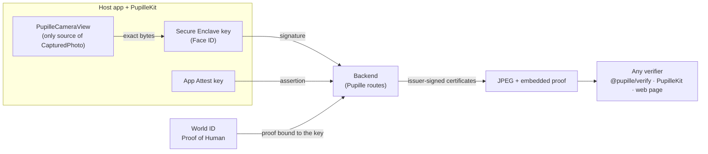

# Pupille SDK

**Add "captured by a verified human on a genuine iPhone" to any app's photos, and let anyone check it.**

Pupille's app proves three things about a photo: the exact bytes came from its camera on an attested iPhone, the author's Secure Enclave key signed them, and that key belongs to a World ID–verified human. This folder packages that as an SDK other apps can embed, and makes the proof travel **inside the JPEG** so it can be checked anywhere, even outside the app that took it.

| Package | What it is |
|---|---|
| [`ios/PupilleKit`](ios/PupilleKit) | Swift package: World ID enrollment, the SDK-owned camera, signing and publishing, offline verification, proof embedding |
| [`verify`](verify) | `@pupille/verify`: TypeScript verifier for Node and browsers, plus the `pupille-proof` CLI. No runtime dependencies. |
| [`web-verifier`](web-verifier) | Drag-and-drop page that checks a JPEG in the browser. Nothing is uploaded. |
| [`ios/Amazon`](ios/Amazon) | Mock store demo: product reviews whose photos are proven to be taken by a verified human |
| [`ios/SampleGram`](ios/SampleGram) | A one-screen app built only on PupilleKit's public API |
| [`scripts/run-samplegram-backend.sh`](scripts/run-samplegram-backend.sh) | Runs the unchanged Pupille backend a second time with SampleGram's app ID |

The Pupille app and backend in the rest of the repo are unchanged. The SDK was extracted from them, and they still carry their own copy of this logic.

## How it works



1. **Enroll once per device.** PupilleKit creates a Secure Enclave key and an App Attest key. The backend checks both, then the user approves a World ID Proof of Human whose signal commits to that key. The backend verifies the proof with World and issues a profile certificate.
2. **Capture.** `PupilleCameraView` is the only way to get a `CapturedPhoto`, so arbitrary images can't be signed. Publishing binds the exact bytes to a one-time challenge, a fresh App Attest assertion and a Face ID signature. The backend recomputes everything and issues a capture certificate that records the app ID.
3. **Verify anywhere.** A verifier needs the bytes, the proof and the issuer's public key. It runs eight checks and trusts no "verified" flag from a server.

| Check | Catches |
|---|---|
| World Human credential certified at signup | Forged profile, missing Proof of Human |
| Profile belongs to this author | Photo relabelled as someone else |
| Device capture certified by Pupille | Forged or mismatched capture certificate |
| Exact photo bytes match | Edited pixels, proof copied onto another photo |
| Caption matches | Edited caption |
| Capture commitment matches | Inconsistent certificate |
| Author signed this capture | Authorship forged by anyone, including the server |
| Captured in a trusted app *(optional)* | Photos from an app you don't trust |

### The proof travels with the file

The proof is one APP11 segment tagged `PUPILLE\0`, holding JSON with the two certificates, the author's signature and the caption. The certificates hash the **original** camera bytes, so a verifier removes that one segment and hashes what's left. JFIF and EXIF stay first, and embedding twice replaces the old proof. C2PA stores its manifest the same way, which makes this a small step from real Content Credentials. Share the file itself (AirDrop, Files, Mail): services that recompress images remove the proof.

## Quickstart: iOS

Add `sdk/ios/PupilleKit` as a local Swift package (it depends on `idkit-swift` 4.0.11). The host app needs `NSCameraUsageDescription`, `NSFaceIDUsageDescription` and a real iPhone: the Secure Enclave and App Attest don't run in the Simulator.

```swift
import PupilleKit

let pupille = PupilleClient(configuration: .init(
    backendURL: URL(string: "https://api.example.com")!,
    worldAppID: "app_…", worldRPID: "rp_…",
    issuerPublicKey: issuerKey,                          // 32-byte Ed25519
    trustedAppIDs: ["TEAMID.com.example.app"]))

// Once per device
let request = try await pupille.beginEnrollment(handle: "xyz")
openURL(request.approvalURL)                             // World App, or World Simulator in staging
let enrollment = try await request.result()

// Capture: the SDK camera is the only source of a CapturedPhoto
PupilleCameraView { photo in captured = photo }
let postID = try await pupille.publish(captured, caption: "Shibuya at dawn")

// Verify: each post is checked on the device against the exact downloaded bytes
let posts = try await pupille.loadFeed()                 // [VerifiedPost], each with .verification
let shareable = try posts[0].shareableJPEG()             // JPEG carrying its proof
let result = try pupille.verify(file: someJPEG)          // nil if the file has no proof
```

[SampleGram's `ContentView.swift`](ios/SampleGram/SampleGram/ContentView.swift) is a complete app in about 200 lines, most of it UI.

## Quickstart: verifying in TypeScript

```ts
import { verifyFile, PUPILLE_ISSUER_PUBLIC_KEY } from "@pupille/verify";

const result = await verifyFile(jpegBytes, {
  issuerPublicKey: PUPILLE_ISSUER_PUBLIC_KEY,
  trustedAppIds: ["4397GAXGZ4.app.pupille.dev", "4397GAXGZ4.app.pupille.sample"],
});
// { verified, checks: [{ id, title, passed }], handle, environment, appId, caption }
```

```sh
cd sdk && npm install
npm test                       # 16 tests: genuine, edited byte, swapped proof, wrong issuer, relabelled author, …
npm run verifier               # web verifier on http://localhost:8790/web-verifier/
npx pupille-proof export --backend http://localhost:8787 --out proofs   # posts → proof-carrying JPEGs
npx pupille-proof verify proofs/*.jpg
```

## Running the SampleGram demo

1. Start Pupille's backend as usual (`tools/run-iphone-mvp.sh`, port 8787).
2. In a second terminal, run `sdk/scripts/run-samplegram-backend.sh` (port 8789, database `pupille_samplegram`, app ID `4397GAXGZ4.app.pupille.sample`, same issuer key).
3. Open `sdk/ios/SampleGram/SampleGram.xcodeproj`, pick your iPhone and run. Set the backend URL to your Mac's address on port 8789.
4. Enroll, take a photo, publish. Tap the badge for the checks, and the share button to AirDrop the proof-carrying JPEG to your Mac.
5. Drop it on the web verifier: it passes and shows SampleGram's app ID. Remove that ID from **Trust settings** and it fails on "Captured in a trusted app".

**World ID caveat:** both backends use the action `pupille-profile-v1`. If World staging enforces one proof per human per action, a simulator identity already used for Pupille can't enroll in SampleGram. Test that first. If it fails, reset Pupille's demo, or create a second action in the Developer Portal. The backend currently hardcodes the action, so the second option needs a small backend change.

### Demo script (3 minutes)

1. Pupille app: take a photo, publish, green badge. Show the proof sheet.
2. Share the file, drop it on the web verifier: all checks pass, in a browser that knows nothing about Pupille.
3. Click **One byte edited**: "Exact photo bytes match" fails. **Proof on another photo**: fails the same way.
4. SampleGram: the same flow in a different app, from about 30 lines of SDK calls. Its photos verify too, under their own app ID.
5. **Untrusted app**: a platform decides which capture apps it trusts.

## What the badge means, and what it doesn't

- It means the exact image passed the capture checks in an attested app, and the World-verified author's device key signed it.
- It can't prove the scene is real: a photo of a screen is still a photo, and a compromised device could inject frames.
- Apple App Attest and World ID evidence is checked by the backend at enrollment and capture. Verifiers trust the issuer's certificates for those two claims, and check everything else themselves.
- Photos from one device share a key, so they're linkable to one pseudonym.
- The World proof is made once, at enrollment, not per photo. IDKit's Swift SDK doesn't expose session proofs yet.

## Roadmap

- Emit real **C2PA / Content Credentials** manifests, with Proof of Human and device attestation as assertions.
- Let each host app run its own issuer, so trust doesn't rest on one server.
- Put the App Attest attestation and the World proof in the file, for checks that don't rely on the issuer.
- **Verified actions**: the same App Attest + enrolled-key flow for likes, votes and reports. The Pupille app's reactions already work this way.
- A per-photo World ID session proof, when IDKit Swift supports sessions.
- Move the Pupille app onto PupilleKit, and add Android.
